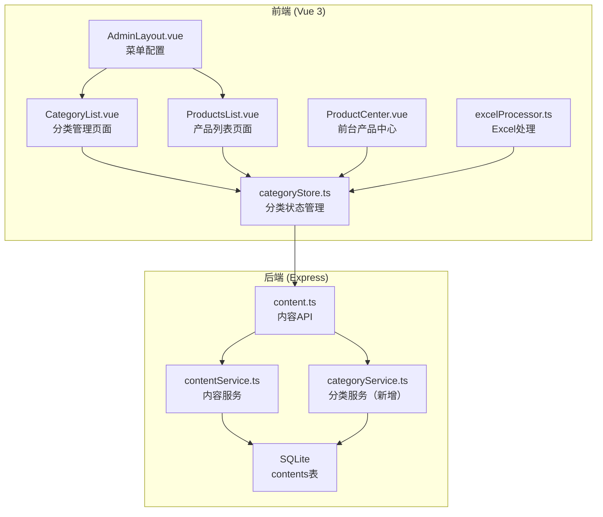

# Design Document: Product Category Management

## Overview

本设计文档描述产品分类动态管理功能的技术实现方案。该功能将现有的硬编码分类配置迁移到数据库存储，并提供完整的后台管理界面，同时支持Excel导入时的新分类联动定义。

### 设计目标

1. **最小化改动** - 复用现有CMS架构（contents表、contentService、UnifiedTableEditor组件）
2. **向后兼容** - 保持现有产品数据的categoryId引用不变
3. **用户体验** - Excel导入时无缝处理新分类，无需切换页面

## Architecture



## Components and Interfaces

### 1. 数据库层

复用现有 `contents` 表，使用 `content_type = 'category'` 存储分类数据。

```sql
-- 分类数据存储在 contents 表中
-- content_type: 'category'
-- content_key: 分类ID (如 'C01', 'C02')
-- draft_data / published_data: JSON格式的分类数据
```

### 2. 后端服务层

#### CategoryService（新增）

```typescript
// server/src/services/categoryService.ts
interface CategoryData {
  id: string           // 分类ID，如 "C01"
  name: string         // 分类名称
  imageName: string    // 图片文件名
  description?: string // 分类描述
}

interface CategoryService {
  // 获取所有分类（已发布）
  getAllPublished(): CategoryData[]
  
  // 获取分类及其产品数量
  getCategoriesWithCount(): Array<CategoryData & { productCount: number }>
  
  // 生成新的分类ID
  generateCategoryId(): string
  
  // 检查分类是否可删除（无关联产品）
  canDelete(categoryId: string): { canDelete: boolean; productCount: number }
  
  // 初始化默认分类（首次启动时）
  initDefaultCategories(): void
  
  // 检测未定义的分类
  detectUndefinedCategories(categoryValues: string[]): string[]
}
```

### 3. 前端组件层

#### CategoryStore（新增）

```typescript
// src/stores/categoryStore.ts
interface CategoryStore {
  // State
  categories: Category[]
  loading: boolean
  initialized: boolean
  
  // Getters
  categoryMap: Map<string, Category>  // ID -> Category
  categoryOptions: Array<{ label: string; value: string }>
  
  // Actions
  loadCategories(): Promise<void>
  getCategoryById(id: string): Category | undefined
  getCategoryName(id: string): string
  getCategoryImagePath(id: string): string
  clearCache(): void
}
```

#### CategoryList.vue（新增）

分类管理页面，复用 `UnifiedTableEditor` 组件：

```typescript
// 列配置
const columns = [
  { key: 'id', label: 'ID', width: 80, editable: false },
  { key: 'imageName', label: '分类图片', type: 'image', width: 100 },
  { key: 'name', label: '分类名称', required: true },
  { key: 'description', label: '描述', type: 'textarea' },
  { key: 'productCount', label: '产品数量', editable: false }
]
```

#### NewCategoryDialog.vue（新增）

Excel导入时的新分类定义弹窗：

```typescript
interface Props {
  visible: boolean
  undefinedCategories: string[]  // 未定义的分类名称列表
}

interface Emits {
  (e: 'confirm', categories: CategoryData[]): void
  (e: 'skip'): void
  (e: 'cancel'): void
}
```

### 4. API接口

复用现有 `/api/content` 和 `/api/admin/content` 路由：

| 方法 | 路径 | 描述 |
|------|------|------|
| GET | `/api/content/category/published` | 获取已发布分类列表 |
| GET | `/api/admin/content/category` | 后台分类列表（含草稿） |
| POST | `/api/admin/content/category/save` | 保存分类草稿 |
| POST | `/api/admin/content/category/publish` | 发布分类 |
| DELETE | `/api/admin/content/category/:key` | 删除分类 |
| GET | `/api/admin/category/with-count` | 获取分类及产品数量 |
| POST | `/api/admin/category/detect-undefined` | 检测未定义分类 |

## Data Models

### Category 数据模型

```typescript
interface Category {
  id: string            // 分类ID, 格式: "C" + 两位数字, e.g., "C01"
  name: string          // 分类名称, e.g., "仪器设备"
  imageName: string     // 图片文件名, e.g., "lab-instruments.png"
  description?: string  // 分类描述（可选）
}
```

### 数据库存储格式

```json
{
  "content_type": "category",
  "content_key": "C01",
  "draft_data": "{\"id\":\"C01\",\"name\":\"仪器设备\",\"imageName\":\"lab-instruments.png\"}",
  "published_data": "{\"id\":\"C01\",\"name\":\"仪器设备\",\"imageName\":\"lab-instruments.png\"}",
  "status": "published"
}
```

### 默认分类数据

系统初始化时，将现有硬编码分类迁移到数据库：

```typescript
const DEFAULT_CATEGORIES: Category[] = [
  { id: 'C01', name: '仪器设备', imageName: 'lab-instruments.png', description: '高精度科学仪器设备' },
  { id: 'C02', name: '实验耗材', imageName: 'lab-consumables.png', description: '实验室常用耗材' },
  { id: 'C03', name: '实验试剂', imageName: 'bio-reagents.png', description: '各类生物化学试剂' },
  { id: 'C04', name: '细胞相关产品', imageName: 'cell-experiments.png', description: '细胞培养相关产品' },
  { id: 'C05', name: '分子生物实验产品', imageName: 'molecular-biology.png', description: '分子生物学实验产品' }
]
```

## Correctness Properties

*A property is a characteristic or behavior that should hold true across all valid executions of a system-essentially, a formal statement about what the system should do. Properties serve as the bridge between human-readable specifications and machine-verifiable correctness guarantees.*

### Property 1: Category ID Uniqueness
*For any* sequence of category creation operations, each generated CategoryId SHALL be unique and not conflict with any existing CategoryId in the system.
**Validates: Requirements 1.4**

### Property 2: Category ID Immutability
*For any* category and any edit operation on that category, the CategoryId SHALL remain unchanged after the edit operation completes.
**Validates: Requirements 1.5**

### Property 3: Delete Protection for Categories with Products
*For any* category that has one or more associated products, the delete operation SHALL fail and return an error indicating the product count.
**Validates: Requirements 1.7**

### Property 4: Default Image Fallback
*For any* category that has no imageName set or has an empty imageName, the getCategoryImagePath function SHALL return the default placeholder image path.
**Validates: Requirements 2.4**

### Property 5: Undefined Category Detection
*For any* list of category values from Excel import, the detectUndefinedCategories function SHALL correctly identify all values that do not match any existing category ID or name.
**Validates: Requirements 3.1, 3.2**

### Property 6: Skip Import Fallback
*For any* product with an undefined category that is skipped during import, the product's categoryId SHALL be set to a designated "uncategorized" value.
**Validates: Requirements 3.5**

### Property 7: Data Persistence Consistency
*For any* category save operation, querying the database immediately after SHALL return data equivalent to what was saved.
**Validates: Requirements 4.2**

### Property 8: Product Count Accuracy
*For any* category, the productCount field SHALL equal the actual count of products in the database that reference that category's ID.
**Validates: Requirements 4.5**

### Property 9: Category Filter Correctness
*For any* category filter applied to the product list, all returned products SHALL have a categoryId matching the filter value.
**Validates: Requirements 5.3**

### Property 10: Draft Isolation
*For any* category modification that has not been published, the public API endpoint SHALL return only the previously published data, not the draft data.
**Validates: Requirements 6.1, 6.4**

## Error Handling

### 前端错误处理

| 场景 | 处理方式 |
|------|----------|
| 分类加载失败 | 显示错误提示，提供重试按钮 |
| 分类名称为空 | 表单验证阻止提交 |
| 删除有产品的分类 | 显示确认弹窗，说明产品数量 |
| 图片上传失败 | 显示错误提示，保留原图片 |
| Excel导入检测到新分类 | 显示新分类定义弹窗 |

### 后端错误处理

| 场景 | HTTP状态码 | 错误信息 |
|------|------------|----------|
| 分类不存在 | 404 | Category not found |
| 分类名称重复 | 400 | Category name already exists |
| 删除有产品的分类 | 400 | Cannot delete category with N products |
| 无效的分类ID格式 | 400 | Invalid category ID format |

## Testing Strategy

### 测试框架选择

- **单元测试**: Vitest
- **属性测试**: fast-check (JavaScript/TypeScript PBT库)
- **组件测试**: Vue Test Utils + Vitest

### 单元测试覆盖

1. **CategoryService**
   - generateCategoryId() 生成唯一ID
   - canDelete() 正确检查产品关联
   - detectUndefinedCategories() 正确识别未定义分类

2. **CategoryStore**
   - loadCategories() 正确加载和缓存数据
   - getCategoryImagePath() 正确返回图片路径或默认值

3. **ExcelProcessor**
   - 正确提取分类字段值
   - 正确处理分类名称到ID的转换

### 属性测试覆盖

每个属性测试配置运行 100 次迭代。

1. **Property 1 测试**: 生成随机数量的分类创建请求，验证所有ID唯一
2. **Property 2 测试**: 生成随机分类和随机编辑操作，验证ID不变
3. **Property 3 测试**: 生成有产品关联的分类，验证删除失败
4. **Property 4 测试**: 生成随机分类（有/无图片），验证图片路径
5. **Property 5 测试**: 生成随机分类值列表，验证未定义检测
6. **Property 8 测试**: 生成随机产品分布，验证计数准确
7. **Property 9 测试**: 生成随机筛选条件，验证结果正确
8. **Property 10 测试**: 生成草稿修改，验证公开API不返回草稿

### 集成测试

1. 完整的分类CRUD流程
2. Excel导入新分类联动流程
3. 分类发布和前台展示流程
