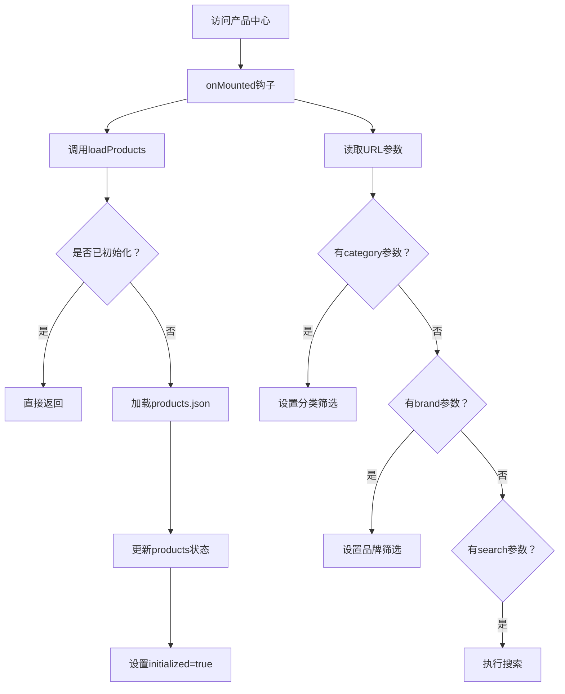

# 产品中心详细说明文档

## 一、产品中心概述

### 1.1 功能定位
产品中心（ProductCenter）是企业官网的核心模块，负责展示所有产品信息，提供强大的搜索和筛选功能，帮助用户快速找到所需产品。

### 1.2 核心功能
- **产品展示**：网格化展示所有产品
- **搜索功能**：支持产品名称、品牌、货号、规格、描述的全文搜索
- **筛选功能**：按品牌、分类进行筛选
- **排序功能**：支持名称正序/倒序排列
- **分页功能**：支持分页浏览，可调整每页显示数量
- **响应式设计**：完美适配PC端和移动端

### 1.3 文件结构
```
src/views/products/
├── ProductCenter.vue       # 产品中心主页面
└── ProductDetail.vue       # 产品详情页

src/components/business/
└── ProductCard.vue         # 产品卡片组件

src/stores/
└── productStore.ts         # 产品状态管理

public/data/
└── products.json           # 产品数据源
```

## 二、产品中心页面架构

### 2.1 页面布局结构

ProductCenter.vue 采用垂直布局结构，从上到下分为：

#### 2.1.1 展示区（ShowcaseBanner）
- **位置**：页面顶部
- **内容**：
  - 标语："探索我们的产品世界"、"为您提供最优质的试剂耗材与仪器设备"
  - 统计数据：产品种类、产品类别、合作品牌（动态计算）
- **样式**：渐变背景，突出展示

#### 2.1.2 搜索区
- **位置**：展示区下方
- **功能**：
  - 搜索框：支持产品名称、品牌、货号搜索
  - 搜索按钮：触发搜索操作
  - 支持Enter键快速搜索
- **样式**：最大宽度3xl，居中显示

#### 2.1.3 筛选区
- **位置**：搜索区下方
- **包含两个筛选模块**：

1. **合作品牌筛选**
   - 显示前8个品牌（可展开查看全部）
   - 包含"所有"选项
   - 选中品牌高亮显示

2. **产品分类筛选**
   - 显示前10个分类（可展开查看全部）
   - 包含"所有"选项
   - 选中分类高亮显示

#### 2.1.4 产品列表区
- **位置**：筛选区下方
- **包含元素**：
  - 工具栏：显示结果数量、排序选项
  - 加载状态：LoadingSpinner组件
  - 空状态：EmptyState组件（无结果时显示）
  - 产品网格：ProductCard组件组成的网格
  - 分页器：页码导航、每页数量调整

### 2.2 响应式设计
- **PC端**：4列网格布局
- **平板端**：2-3列布局
- **手机端**：1-2列布局
- **搜索框**：移动端全宽显示
- **筛选标签**：自适应换行

## 三、数据流与状态管理

### 3.1 productStore 详细分析

#### 3.1.1 State（状态）
```typescript
// 产品数据
const products = ref<Product[]>([])
const loading = ref(false)
const error = ref<string | null>(null)
const initialized = ref(false)

// 筛选状态
const filters = ref<ProductFilters>({
  search: '',        // 搜索关键词
  categoryId: '',    // 选中的分类ID
  brand: ''          // 选中的品牌
})

// 排序状态
const sortBy = ref<SortOption>('name-asc')  // 排序方式
```

#### 3.1.2 Getters（计算属性）

1. **allBrands**：获取所有品牌列表
   - 从产品中提取品牌字段
   - 去重并按字母顺序排序

2. **productsByCategory**：按分类分组产品
   - 返回Map结构，key为分类ID，value为产品列表

3. **filteredProducts**：筛选后的产品列表
   - 支持搜索筛选（名称、规格、描述、品牌、货号）
   - 支持分类筛选
   - 支持品牌筛选

4. **sortedProducts**：排序后的产品列表
   - 在筛选结果基础上进行排序
   - 支持名称正序/倒序

5. **activeFiltersCount**：激活的筛选条件数量

#### 3.1.3 Actions（方法）

1. **loadProducts()**：加载产品数据
   - 懒加载机制：已加载则直接返回
   - 从 `/data/products.json` 获取数据
   - 错误处理机制

2. **getProductById(id)**：根据ID获取产品
3. **getProductsByCategoryId(categoryId)**：获取分类下的产品
4. **setFilter(key, value)**：设置单个筛选条件
5. **clearAllFilters()**：清空所有筛选条件
6. **setSortBy(sort)**：设置排序方式

### 3.2 数据加载流程



### 3.3 URL同步机制
- **监听filters变化**：使用watch深度监听
- **更新URL**：筛选条件变化时自动更新URL参数
- **初始加载**：页面加载时从URL读取筛选条件

## 四、产品卡片组件（ProductCard）

### 4.1 组件结构
```vue
<template>
  <article class="product-card" @click="goToDetail">
    <!-- 产品图片区 -->
    <div class="product-card-image">
      <div class="image-wrapper">
        
        <!-- 备用渐变背景 -->
      </div>
    </div>

    <!-- 产品信息 -->
    <div class="product-card-content">
      <h3 class="product-card-title">产品名称</h3>
      <div class="product-card-info">
        <div class="info-row">品牌：xxx</div>
        <div class="info-row">货号：xxx</div>
        <div class="info-row">分类：xxx</div>
        <div class="info-row">规格：xxx</div>
      </div>
    </div>
  </article>
</template>
```

### 4.2 关键特性

1. **图片显示策略**
   - 使用分类图片而非产品具体图
   - 图片路径：`/images/products/${category.imageName}`
   - 加载失败时显示渐变背景

2. **搜索高亮**
   - 使用DOMPurify防止XSS攻击
   - 支持多关键词高亮
   - 高亮样式：黄色背景

3. **交互效果**
   - 悬停上浮效果（translateY(-6px)）
   - 阴影增强
   - 图片区域颜色变化

### 4.3 样式系统
- **卡片基础**：白色背景、圆角、阴影
- **图片区域**：渐变背景、内嵌阴影
- **悬停效果**：平滑过渡动画

## 五、分类系统（useCategoryImage）

### 5.1 分类数据结构
```typescript
export const CATEGORIES: Category[] = [
  {
    id: 'C01',
    name: '仪器设备',
    imageName: 'lab-instruments.png',
    description: '高精度科学仪器设备...'
  },
  // ... 其他分类
]
```

### 5.2 工具函数
- **getCategoryById(id)**：根据ID获取分类对象
- **getCategoryName(id)**：获取分类名称
- **getCategoryImagePath(id)**：获取分类图片路径
- **useCategoryImage(categoryId)**：组合式API，返回图片路径

### 5.3 图片资源管理
- **存放路径**：`/public/images/products/`
- **命名规则**：使用英文名称，如 `lab-instruments.png`
- **备用图片**：`/images/common/placeholder.png`

## 六、分页系统（usePagination）

### 6.1 功能特性
- **自定义页大小**：默认12条/页，支持24、48条/页
- **滚动定位**：分页后滚动到产品区域顶部
- **URL同步**：页码参数与URL同步

### 6.2 使用方式
```typescript
const {
  currentPageItems,    // 当前页数据
  paginationInfo,      // 分页信息
  goToPage,           // 跳转页码
  setPageSize         // 设置页大小
} = usePagination(
  computed(() => productStore.sortedProducts),
  {
    initialPageSize: 12,
    scrollTarget: '.products-section'
  }
)
```

### 6.3 分页信息结构
```typescript
interface PaginationInfo {
  currentPage: number    // 当前页
  totalPages: number     // 总页数
  pageSize: number       // 每页数量
  totalItems: number     // 总条数
  startIndex: number     // 起始索引
  endIndex: number       // 结束索引
}
```

## 七、搜索功能详解

### 7.1 搜索字段
搜索功能支持以下字段：
- **产品名称**（name）
- **产品规格**（specs）
- **产品描述**（desc）
- **品牌**（brand）
- **货号**（sku）

### 7.2 搜索逻辑
```typescript
if (filters.value.search) {
  const keyword = filters.value.search.toLowerCase()
  result = result.filter(product =>
    product.name.toLowerCase().includes(keyword) ||
    product.specs.toLowerCase().includes(keyword) ||
    product.desc.toLowerCase().includes(keyword) ||
    product.brand?.toLowerCase().includes(keyword) ||
    product.sku?.toLowerCase().includes(keyword)
  )
}
```

### 7.3 搜索体验优化
- **Enter键支持**：输入框支持回车触发搜索
- **搜索结果高亮**：关键词在结果中高亮显示
- **空结果处理**：显示友好的空状态提示

## 八、数据格式说明

### 8.1 产品数据结构（products.json）
```json
[
  {
    "id": "P001",              // 产品ID
    "name": "DMEM高糖培养基",   // 产品名称
    "categoryId": "C04",       // 分类ID
    "brand": "KIRGEN",         // 品牌
    "sku": "KIR-细胞-00002",   // 货号
    "specs": "500mL",          // 规格
    "unit": "瓶",              // 单位
    "desc": "DMEM高糖培养基..." // 描述
  }
]
```

### 8.2 数据量级
- **当前产品数量**：根据实际JSON文件确定
- **分类数量**：5个主要分类
- **品牌数量**：动态从产品中提取

## 九、性能优化

### 9.1 懒加载机制
- **产品数据**：使用initialized标记避免重复加载
- **图片懒加载**：产品卡片图片支持懒加载

### 9.2 计算缓存
- **筛选结果**：使用computed缓存筛选后的产品
- **排序结果**：在筛选结果基础上排序
- **品牌列表**：缓存提取的品牌列表

### 9.3 虚拟滚动
- 当前版本未实现，可在产品量大时考虑引入

## 十、扩展性设计

### 10.1 新增字段支持
- Product接口已定义，可轻松添加新字段
- 搜索功能可扩展支持新字段

### 10.2 筛选条件扩展
- 当前支持品牌和分类筛选
- 可轻松添加价格区间、库存状态等筛选

### 10.3 排序功能扩展
- 当前支持名称排序
- 可添加价格、销量等排序选项

## 十一、管理后台集成

### 11.1 Excel导入导出
- 位置：`/admin/excel`
- 功能：通过Excel文件批量更新产品数据

### 11.2 产品管理
- 位置：`/admin/dashboard`
- 功能：增删改查产品信息

### 11.3 数据更新流程
1. 管理员更新Excel文件
2. 运行 `update_products.py` 脚本
3. 自动生成 `products.json`
4. 前端自动加载最新数据

## 十二、总结

产品中心作为企业官网的核心模块，具有以下特点：

1. **功能完善**：搜索、筛选、排序、分页一应俱全
2. **性能优化**：懒加载、计算缓存、响应式设计
3. **用户体验**：直观的界面设计，流畅的交互体验
4. **可维护性**：清晰的代码结构，完善的注释
5. **可扩展性**：模块化设计，易于扩展新功能
6. **数据安全**：XSS防护，图片加载错误处理

该产品中心实现了一个现代化B2B电商平台应有的所有核心功能，为用户提供了高效、便捷的产品浏览体验。