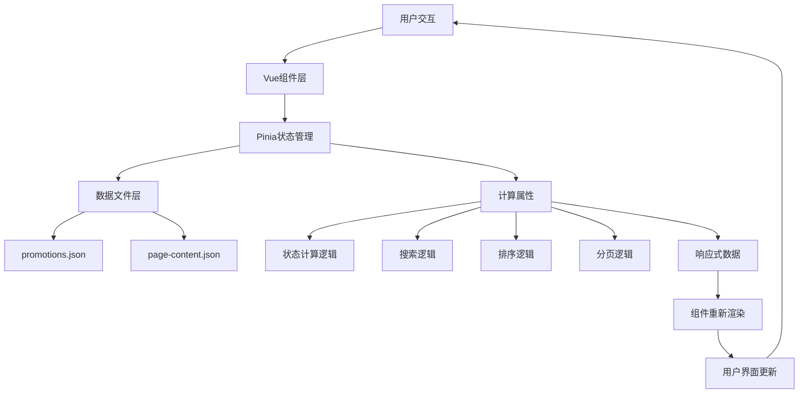

# 📋 Cursor Project Context & Architecture Specification

## 1. 项目概述 (Project Overview)

**目标**：开发一个纯前端的企业展示型官网（Static Site），复刻现有全栈项目的核心 UI/UX，但去后端化。

**核心特点**：

1.  **无后端架构 (Serverless/Static)**：
    *   不依赖 API 服务器，所有数据源为静态 JSON 文件。
    *   即使原参考项目使用 API，本项目必须将其转换为前端直接读取 `public/data/*.json`。

2.  **Excel 驱动 (Excel-driven Data Source)**：
    *   数据源由 Excel 维护，通过 Node.js 脚本转换为 JSON。
    *   支持 mock 数据生成，模拟 3000+ 产品数据。

3.  **海量数据轻量化 (Lightweight Data Strategy)**：
    *   约 3000 个产品。
    *   **核心规则**：无独立产品图，所有产品图片复用其所属的“分类封面图” (Category Image Mapping)。
    *   若产品有特定品牌 logo 或其他少量图片，可作为例外处理，但默认走分类图。

4.  **性能优先 (Performance First)**：
    *   数据一次性加载至内存（Pinia），实现毫秒级搜索、筛选、排序。
    *   客户端分页 (Client-side Pagination) 和 客户端模糊搜索 (Client-side Fuzzy Search)。

## 2. 技术栈 (Tech Stack)

*   **Core**: Vue 3 (Composition API, `<script setup>`) + TypeScript + Vite
*   **Router**: Vue Router 4
*   **State Management**: Pinia (用于缓存全量 JSON 数据 + 页面内容配置)
*   **Styling**: Tailwind CSS (主推) + SCSS (辅助)
*   **Data Pipeline**: Node.js (xlsx + fs) 用于 ETL 处理 (Excel -> JSON)
*   **Icons**: FontAwesome or Heroicons (Vue components)
*   **Admin UI**: Element Plus (管理界面组件库)
*   **Utilities**: @vueuse/core (组合式工具函数库，提供 useDebounceFn 等)
*   **Excel Processing**: xlsx (npm包名，前端Excel解析，原SheetJS)
*   **File Management**: 前端文件处理 + 下载功能

### 2.2 完整依赖清单 (package.json)

```json
{
  "dependencies": {
    "vue": "^3.4.0",
    "vue-router": "^4.2.0",
    "pinia": "^2.1.0",
    "@vueuse/core": "^10.7.0",
    "element-plus": "^2.4.0",
    "@element-plus/icons-vue": "^2.3.0"
  },
  "devDependencies": {
    "typescript": "^5.3.0",
    "vite": "^5.0.0",
    "@vitejs/plugin-vue": "^4.5.0",
    "tailwindcss": "^3.4.0",
    "postcss": "^8.4.0",
    "autoprefixer": "^10.4.0",
    "sass": "^1.69.0",
    "xlsx": "^0.18.5"
  }
}
```

## 3. 详细目录结构规范 (Directory Structure)

请严格遵循以下目录结构进行代码生成。我们将采用 `views` (页面) + `components` (组件) 的组织方式，并按业务领域拆分组件。

```plaintext
/
├── public/                      # 纯静态资源 (不经过 Webpack/Vite 处理)
│   ├── data/                    # [Generated] 存放脚本生成的 JSON 数据源
│   │   ├── site-info.json       # 网站全局信息 (Logo, Footer info, SEO)
│   │   ├── pages/               # 各独立页面的静态内容 (CMS替代方案)
│   │   │   ├── home.json        # 首页文案、Banner配置
│   │   │   ├── about.json       # 关于我们页面的板块内容
│   │   │   ├── product-center.json # 产品中心页面配置
│   │   │   ├── brand-center.json # 品牌中心页面配置
│   │   │   └── news-center.json  # 资讯中心页面配置
│   │   ├── categories.json      # 分类字典 (ID, Name, ImageMap)
│   │   ├── products.json        # 全量产品数据 (Array<Product>)
│   │   ├── brands.json          # 品牌数据 (Array<Brand>)
│   │   └── promotions.json      # 促销/资讯数据 (Array<Promotion>)
│   └── images/
│       ├── categories/          # 分类封面图库 (e.g., "C01.jpg")
│       ├── brands/              # 品牌 Logo 图库 (e.g., "brand-olympus.png")
│       ├── promotions/          # 促销/资讯活动图片
│       └── common/              # 通用图片 (Logo, Placeholder, Favicon)
│
├── scripts/                     # 数据处理工作流
│   ├── raw-data/                # [Source] 原始 Excel 数据源
│   │   ├── products.xlsx        # 产品信息主表
│   │   ├── categories.xlsx      # 分类图片映射表
│   │   ├── brands.xlsx          # 品牌信息表
│   │   └── promotions.xlsx      # 促销/资讯活动表
│   └── generate-json.js         # ETL 脚本: 读取 Excel -> 校验 -> 生成 public/data/*.json
│
├── src/
│   ├── assets/                  # 需编译的静态资源
│   │   └── styles/
│   │       ├── main.css         # Tailwind 引入 & 全局重置
│   │       └── variables.scss   # scss 变量 (如有需要)
│   │
│   ├── types/                   # TypeScript 类型定义
│   │   ├── index.ts             # 统一导出
│   │   ├── models.ts            # 数据模型 (Product, Category)
│   │   └── view-data.ts         # 页面内容模型 (PageContent, Section)
│   │
│   ├── stores/                  # Pinia 状态管理
│   │   ├── productStore.ts      # 核心：负责加载 products.json, 执行筛选/排序/分页
│   │   ├── categoryStore.ts     # 负责分类数据的加载与索引
│   │   ├── brandStore.ts        # 负责加载 brands.json, 管理自主品牌和甄选品牌
│   │   ├── promotionStore.ts    # 负责加载 promotions.json, 管理促销/资讯活动
│   │   ├── pageContentStore.ts  # 负责加载 pages/*.json 静态页面内容
│   │   ├── adminStore.ts        # 🆕 管理页面状态管理
│   │   └── configStore.ts       # 🆕 配置数据管理
│   │
│   ├── hooks/                   # 组合式函数 (Composables)
│   │   ├── useCategoryImage.ts  # 核心业务：根据 categoryId 计算图片路径
│   │   └── usePagination.ts     # 通用分页逻辑
│   │
│   ├── router/
│   │   └── index.ts             # 路由配置
│   │
│   ├── utils/                   # 🆕 工具函数
│   │   ├── excelProcessor.js    # Excel处理工具
│   │   ├── configValidator.js   # 配置验证工具
│   │   └── fileHandler.js       # 文件操作工具
│   │
│   ├── components/              # 通用组件库
│   │   ├── common/              # 全局基础组件
│   │   │   ├── AppHeader.vue    # 顶部导航
│   │   │   ├── AppFooter.vue    # 底部信息
│   │   │   ├── LoadingSpinner.vue # 加载状态
│   │   │   ├── EmptyState.vue   # 无数据提示
│   │   │   └── BioAnimations.vue # 背景动画 (复刻参考项目的生物科技感)
│   │   │
│   │   └── business/            # 跨页面复用的业务组件
│   │       ├── ProductCard.vue  # 产品卡片 (包含图片映射逻辑)
│   │       ├── BrandCard.vue    # 品牌卡片 (显示品牌 Logo)
│   │       ├── NewsCard.vue     # 资讯/促销卡片
│   │       └── SectionTitle.vue # 统一的板块标题样式
│   │
│   ├── views/                   # 页面视图 (Page Level)
│   │   ├── home/
│   │   │   ├── HomePage.vue
│   │   │   └── components/      # 首页特有组件
│   │   │       ├── HeroBanner.vue
│   │   │       ├── CategoryShowcase.vue
│   │   │       ├── ProductCenter.vue  # 首页产品中心预览
│   │   │       ├── BrandCenter.vue    # 首页品牌中心预览
│   │   │       └── NewsCenter.vue     # 首页资讯中心预览
│   │   │
│   │   ├── product/
│   │   │   ├── ProductCenter.vue # 产品中心 (列表页)
│   │   │   ├── ProductDetail.vue # 产品详情页
│   │   │   └── components/      # 产品页特有组件
│   │   │       ├── FilterSidebar.vue # 侧边筛选栏 (分类+品牌)
│   │   │       ├── ProductGrid.vue   # 产品网格容器
│   │   │       ├── SearchBar.vue     # 搜索框
│   │   │       └── SpecsTable.vue    # 详情页规格表
│   │   │
│   │   ├── brand/
│   │   │   ├── BrandCenter.vue  # 品牌中心 (列表页)
│   │   │   ├── BrandDetail.vue  # 品牌详情页 (可选)
│   │   │   └── components/      # 品牌页特有组件
│   │   │       ├── BrandGrid.vue     # 品牌网格 (自主品牌/甄选品牌)
│   │   │       └── BrandSection.vue  # 品牌区块组件
│   │   │
│   │   ├── news/
│   │   │   ├── NewsCenter.vue   # 资讯中心 (列表页)
│   │   │   ├── PromotionDetail.vue # 促销活动详情页
│   │   │   └── components/      # 资讯页特有组件
│   │   │       ├── NewsList.vue      # 资讯列表容器
│   │   │       ├── PromotionCard.vue # 促销活动卡片
│   │   │       ├── PromotionGrid.vue # 促销活动网格
│   │   │       ├── NewsSearchBar.vue # 资讯搜索框
│   │   │       ├── StatusFilter.vue  # 状态筛选器
│   │   │       ├── DateFilter.vue     # 日期筛选器
│   │   │       ├── StatusBadge.vue    # 状态标签 (进行中/已结束/即将开始)
│   │   │       ├── PriceDisplay.vue   # 价格展示组件
│   │   │       ├── DiscountBadge.vue  # 折扣标签组件
│   │   │       └── PromotionPagination.vue # 分页组件
│   │   │
│   │   └── about/
│   │       ├── AboutPage.vue
│   │       └── components/
│   │           ├── TimeLine.vue      # 发展历程
│   │           └── IntroSection.vue  # 介绍板块
│   │   │
│   │   └── admin/                    # 🆕 隐藏管理模块
│   │   │   ├── AdminLayout.vue     # 管理页面主布局
│   │   │   ├── Dashboard.vue       # 管理首页/仪表板
│   │   │   ├── ExcelManager.vue    # Excel上传管理
│   │   │   ├── ConfigManager.vue   # 前端配置管理
│   │   │   └── components/         # 管理页面组件
│   │   │       ├── ExcelUploader.vue   # Excel上传组件
│   │   │       ├── DataTable.vue       # 数据预览表格
│   │   │       ├── ConfigEditor.vue    # 配置编辑器
│   │   │       └── JsonPreview.vue     # JSON预览组件
│   │   │
│   ├── App.vue
│   └── main.ts
```

## 4. 数据模型定义 (Data Models)

请在 `src/types/models.ts` 中定义以下接口：

```typescript
// 分类接口
export interface Category {
  id: string;        // e.g., "C01"
  name: string;      // e.g., "精密仪器"
  imageName: string; // e.g., "instrument-cover.jpg"
  description?: string;
}

// 产品接口 (基于参考项目深化)
export interface Product {
  id: string;            // e.g., "P1001"
  name: string;          // e.g., "高精度显微镜 Model X"
  categoryId: string;    // e.g., "C01" (外键)
  brand?: string;        // e.g., "Olympus" (品牌筛选)
  sku?: string;          // e.g., "SKU-12345"
  specs: string;         // 规格参数 (e.g., "10x-100x Zoom")
  unit?: string;         // e.g., "台"
  desc: string;          // 产品详细描述
  
  // 价格与库存字段 (可选，用于筛选功能)
  originalPrice?: number;  // 原价
  currentPrice?: number;   // 现价（促销价）
  stock?: number;          // 库存数量
  isOnSale?: boolean;      // 是否促销中
  
  // 注意：不包含 image_url，使用 Category 映射逻辑
}

// 品牌接口
export interface Brand {
  brand_id: string;        // e.g., "B001"
  show_name: string;       // e.g., "Olympus"
  logo_url: string;        // e.g., "/images/brands/olympus.png"
  category?: string;       // 品牌分类
  route?: string;          // 品牌详情页路由 (可选)
  is_own?: boolean;        // 是否为自主品牌 (true: 自主品牌, false: 甄选品牌)
  
  // 扩展字段 (用于品牌中心筛选和展示)
  description?: string;    // 品牌描述
  country?: string;        // 品牌国家/地区
  is_featured?: boolean;   // 是否推荐品牌
  product_count?: number;  // 关联产品数量
  priority?: number;       // 显示优先级
  website_url?: string;    // 官网链接
}

// 促销/资讯接口 (基于原项目业务架构优化)
export interface Promotion {
  id: number;            // 促销活动 ID
  title: string;         // 标题
  summary: string;      // 摘要
  description?: string;  // 详细描述 (详情页使用)
  image_url?: string;   // 活动图片
  icon_class?: string;   // FontAwesome 图标类名 (默认: 'fas fa-bullhorn')

  // 时间信息
  start_date?: string;   // 开始日期 (YYYY-MM-DD)
  end_date?: string;     // 结束日期 (YYYY-MM-DD)

  // 价格信息
  original_price?: number; // 原价
  current_price?: number; // 现价
  discount_badge?: string; // 折扣标签 (e.g., "8折")

  // 扩展信息
  category?: string;     // 活动分类
  tags?: string[];       // 标签数组
  is_featured?: boolean; // 是否为推荐活动
  priority?: number;     // 显示优先级
  applicable_products?: string; // 适用产品描述

  // 状态信息 (动态计算)
  status?: 'active' | 'ended' | 'coming'; // 活动状态
  statusText?: string;   // 状态文本 (e.g., "进行中")
}

// 页面内容接口 (用于 CMS 式内容管理)
export interface PageContent {
  id: string;        // e.g., "about_us"
  title: string;
  sections: PageSection[];
}

export interface PageSection {
  id: string;
  title: string;
  type: 'text' | 'gallery' | 'features' | 'timeline';
  items: any[];      // 灵活结构，视具体 section 而定
}
```

## 5. JSON 数据文件结构示例 (JSON Data Structure Examples)

以下是各个 JSON 数据文件的具体结构示例，供开发时参考：

### 5.1 `public/data/categories.json`

```json
[
  {
    "id": "C01",
    "name": "精密仪器",
    "imageName": "instrument-cover.jpg",
    "description": "高精度科学仪器设备"
  },
  {
    "id": "C02",
    "name": "实验耗材",
    "imageName": "consumables-cover.jpg",
    "description": "实验室常用耗材与试剂"
  },
  {
    "id": "C03",
    "name": "生物试剂",
    "imageName": "reagent-cover.jpg",
    "description": "各类生物化学试剂"
  }
]
```

### 5.2 `public/data/products.json`

```json
[
  {
    "id": "P1001",
    "name": "高精度显微镜 Model X-2000",
    "categoryId": "C01",
    "brand": "Olympus",
    "sku": "SKU-OLY-X2000",
    "specs": "放大倍数: 10x-100x, 分辨率: 0.1μm, 光源: LED",
    "unit": "台",
    "desc": "专业级高精度显微镜，适用于细胞观察、病理分析等精密研究。采用先进的LED照明系统，提供清晰明亮的观察体验。"
  },
  {
    "id": "P1002",
    "name": "PCR 反应管 0.2ml",
    "categoryId": "C02",
    "brand": "Eppendorf",
    "sku": "SKU-EPP-02ML",
    "specs": "容量: 0.2ml, 材质: 聚丙烯, 数量: 1000支/盒",
    "unit": "盒",
    "desc": "高品质PCR反应管，适用于PCR扩增实验。采用优质聚丙烯材料，确保实验结果的准确性和可靠性。"
  },
  {
    "id": "P1003",
    "name": "DNA提取试剂盒",
    "categoryId": "C03",
    "brand": "Qiagen",
    "sku": "SKU-QIA-DNA-50",
    "specs": "提取量: 50次, 适用样本: 血液/组织/细胞",
    "unit": "盒",
    "desc": "快速高效的DNA提取试剂盒，操作简便，提取纯度高，适用于多种样本类型。"
  }
]
```

### 5.3 `public/data/brands.json`

```json
[
  {
    "brand_id": "B001",
    "show_name": "Olympus",
    "logo_url": "/images/brands/olympus.png",
    "category": "精密仪器",
    "route": "/brand/olympus",
    "is_own": false
  },
  {
    "brand_id": "B002",
    "show_name": "Eppendorf",
    "logo_url": "/images/brands/eppendorf.png",
    "category": "实验耗材",
    "route": "/brand/eppendorf",
    "is_own": false
  },
  {
    "brand_id": "B003",
    "show_name": "Qiagen",
    "logo_url": "/images/brands/qiagen.png",
    "category": "生物试剂",
    "route": "/brand/qiagen",
    "is_own": false
  },
  {
    "brand_id": "B101",
    "show_name": "BioTech Pro",
    "logo_url": "/images/brands/biotech-pro.png",
    "category": "自主品牌",
    "route": null,
    "is_own": true
  },
  {
    "brand_id": "B102",
    "show_name": "LabMaster",
    "logo_url": "/images/brands/labmaster.png",
    "category": "自主品牌",
    "route": null,
    "is_own": true
  }
]
```

### 5.4 `public/data/promotions.json`

```json
[
  {
    "id": 1,
    "title": "春季新品发布会 - 显微镜系列特惠",
    "summary": "Olympus 显微镜全线产品8折优惠，限时抢购！",
    "description": "本次春季新品发布会，我们特别推出 Olympus 显微镜系列产品8折特惠活动。活动期间购买任意型号显微镜，均可享受8折优惠，更有专业技术人员提供免费安装调试服务。",
    "image_url": "/images/promotions/spring-microscope.jpg",
    "start_date": "2025-03-01",
    "end_date": "2025-03-31",
    "original_price": 50000,
    "current_price": 40000,
    "discount_badge": "8折",
    "icon_class": "fas fa-microscope",
    "applicable_products": "Olympus 全系列显微镜产品"
  },
  {
    "id": 2,
    "title": "PCR 耗材批量采购优惠",
    "summary": "Eppendorf PCR 反应管批量采购，满100盒享9折优惠",
    "description": "为回馈广大客户，现推出 Eppendorf PCR 反应管批量采购优惠活动。单次采购满100盒，即可享受9折优惠，更有免费配送服务。",
    "image_url": "/images/promotions/pcr-bulk.jpg",
    "start_date": "2025-04-01",
    "end_date": "2025-04-30",
    "original_price": 500,
    "current_price": 450,
    "discount_badge": "9折",
    "icon_class": "fas fa-flask",
    "applicable_products": "Eppendorf PCR 反应管系列"
  },
  {
    "id": 3,
    "title": "DNA提取试剂盒新品上市",
    "summary": "Qiagen DNA提取试剂盒新品上市，前100名客户享7折优惠",
    "description": "Qiagen 最新款 DNA提取试剂盒正式上市，采用最新提取技术，提取效率提升30%。新品上市期间，前100名客户可享受7折优惠，数量有限，先到先得！",
    "image_url": "/images/promotions/dna-kit-new.jpg",
    "start_date": "2025-05-01",
    "end_date": "2025-05-15",
    "original_price": 800,
    "current_price": 560,
    "discount_badge": "7折",
    "icon_class": "fas fa-dna",
    "applicable_products": "Qiagen DNA提取试剂盒新品"
  }
]
```

### 5.5 `public/data/pages/product-center.json`

```json
{
  "id": "product_center",
  "title": "产品中心",
  "showcase": {
    "summaryLines": [
      "探索我们的产品世界",
      "为您提供最优质的科学仪器与试剂"
    ],
    "stats": [
      {
        "key": "productCount",
        "number": "3000+",
        "label": "产品种类"
      },
      {
        "key": "categoryCount",
        "number": "50+",
        "label": "产品分类"
      },
      {
        "key": "brandCount",
        "number": "100+",
        "label": "合作品牌"
      }
    ]
  },
  "content": {
    "productSection": {
      "searchPlaceholder": "搜索产品名称、品牌或规格...",
      "filterLabels": {
        "category": "产品分类",
        "brand": "合作品牌"
      }
    }
  }
}
```

### 5.6 `public/data/pages/brand-center.json`

```json
{
  "id": "brand_center",
  "title": "品牌中心",
  "showcase": {
    "summaryLines": [
      "与全球知名品牌合作",
      "为您提供高品质的生物技术产品与解决方案"
    ],
    "stats": [
      {
        "key": "brandCount",
        "number": "100+",
        "label": "合作品牌"
      },
      {
        "key": "ownBrandCount",
        "number": "10+",
        "label": "自主品牌"
      }
    ]
  },
  "brandSections": {
    "ownBrandsSection": {
      "id": "own-brands",
      "mainTitle": "自主品牌",
      "subTitle": "Our Own Brands"
    },
    "selectedBrandsSection": {
      "id": "selected-brands",
      "mainTitle": "甄选品牌",
      "subTitle": "Selected Brands"
    }
  }
}
```

### 5.7 `public/data/pages/news-center.json`

```json
{
  "id": "news_center",
  "title": "资讯中心",
  "showcase": {
    "summaryLines": [
      "最新活动与资讯",
      "第一时间了解我们的产品动态与优惠信息"
    ]
  },
  "content": {
    "id": "latest-promotions",
    "title": "最新促销活动"
  }
}
```

### 5.8 `public/data/site-info.json`

```json
{
  "name": "生物科技企业官网",
  "logo": "/images/common/logo.png",
  "contact": {
    "phone": "400-123-4567",
    "email": "contact@biotech.com",
    "address": "北京市海淀区中关村大街1号"
  },
  "socials": {
    "wechat": "biotech_official",
    "linkedin": "https://linkedin.com/company/biotech"
  },
  "footer": {
    "copyright": "© 2025 生物科技企业. 保留所有权利.",
    "links": [
      {
        "title": "关于我们",
        "url": "/about"
      },
      {
        "title": "产品中心",
        "url": "/products"
      },
      {
        "title": "品牌中心",
        "url": "/brands"
      },
      {
        "title": "资讯中心",
        "url": "/news"
      }
    ]
  }
}
```

## 6. 核心业务逻辑 (Key Business Logic)

### A. 产品中心业务架构 (Product Center Business Architecture)

**基于原项目功能分析，整合设计的完整产品中心业务逻辑**：

#### A.1 📱 核心功能模块

**产品展示模块**：
- **产品列表展示**: 响应式网格布局，支持 1-5 列自适应
- **产品分类展示**: 按分类分组显示产品，支持分类筛选
- **产品详情页**: 完整产品信息展示，包含规格参数表
- **产品图片策略**: 使用分类图片映射 (`useCategoryImage` Hook)
- **产品数据源**: 从 `public/data/products.json` 动态加载

**交互功能模块**：
- **实时搜索**: 防抖搜索 (300ms)，支持产品名称、品牌、规格、描述搜索
- **关键词高亮**: 搜索结果中自动高亮匹配词汇，支持多关键词
- **多维度筛选**: 分类、品牌、价格区间、库存状态、促销状态
- **智能排序**: 名称升序/降序、价格升序/降序、品牌排序
- **筛选标签管理**: 显示激活的筛选条件，支持快速移除和清空

**用户体验模块**：
- **骨架屏加载**: 优雅的加载状态，避免页面跳动
- **空状态处理**: 友好的无数据提示和操作建议
- **错误恢复**: 网络错误处理和重试机制
- **分页功能**: 大量数据的分页展示，支持页码跳转
- **返回顶部**: 平滑滚动回到页面顶部
- **状态持久化**: 页面刷新后保持筛选和排序状态

#### A.2 🔄 数据流与状态管理

**数据加载策略**：
```typescript
// 🚀 并行数据加载
onMounted(async () => {
  await Promise.all([
    productStore.loadProducts(),     // 3000+ 产品数据
    categoryStore.loadCategories(),   // 50+ 分类数据
    brandStore.loadBrands(),         // 100+ 品牌数据
    pageContentStore.fetchPage('product-center') // 页面配置
  ])
})
```

**状态管理架构（简化版）**：
```typescript
// Product Store 状态结构
import { defineStore } from 'pinia'
import type { Product, Category } from '@/types'

export const useProductStore = defineStore('product', {
  state: () => ({
    // 🔹 原始数据 (内存缓存)
    products: [] as Product[],
    categories: [] as Category[],
    loading: false,
    error: null as string | null
  }),

  getters: {
    // 按分类分组
    productsByCategory: (state) => {
      const map = new Map<string, Product[]>()
      state.products.forEach(p => {
        const list = map.get(p.categoryId) || []
        list.push(p)
        map.set(p.categoryId, list)
      })
      return map
    },
    
    // 获取所有品牌
    allBrands: (state) => {
      return [...new Set(state.products.map(p => p.brand).filter(Boolean))]
    }
  },

  actions: {
    async loadProducts() {
      this.loading = true
      try {
        const res = await fetch('/data/products.json')
        this.products = await res.json()
      } catch (e) {
        this.error = e instanceof Error ? e.message : '加载失败'
      } finally {
        this.loading = false
      }
    },

    async loadCategories() {
      const res = await fetch('/data/categories.json')
      this.categories = await res.json()
    }
  }
})

// 筛选和分页逻辑放在组件层或 composable 中，而非 Store
```

#### A.3 🔍 搜索功能业务逻辑

**防抖搜索实现**：
```typescript
// src/hooks/useSearch.ts
export function useProductSearch(delay = 300) {
  const searchQuery = ref('')
  const isSearching = ref(false)
  const searchResults = ref<Product[]>([])

  // 🚀 防抖搜索函数
  const debouncedSearch = useDebounceFn(async (query: string) => {
    if (!query.trim()) {
      searchResults.value = []
      productStore.setFilter('search', '')
      return
    }

    isSearching.value = true

    try {
      // 🔍 执行搜索逻辑
      await new Promise(resolve => setTimeout(resolve, 100)) // 模拟搜索延迟
      productStore.setFilter('search', query.trim())
      searchResults.value = productStore.filteredProducts

      // 搜索完成
    } finally {
      isSearching.value = false
    }
  }, delay)

  // 👂 监听搜索输入
  watch(searchQuery, (newQuery) => {
    debouncedSearch(newQuery)
  })

  return {
    searchQuery,
    isSearching,
    searchResults,
    clearSearch: () => {
      searchQuery.value = ''
      searchResults.value = []
    }
  }
}
```

**关键词高亮实现**：
```typescript
// src/utils/highlightKeywords.ts
export function highlightKeywords(text: string, keywords: string): string {
  if (!keywords || !text) return text

  const keywordList = keywords
    .trim()
    .split(/\s+/)
    .filter(keyword => keyword.length > 0)
    .map(keyword => keyword.replace(/[.*+?^${}()|[\]\\]/g, '\\$&'))

  let highlightedText = text

  keywordList.forEach(keyword => {
    const regex = new RegExp(`(${keyword})`, 'gi')
    highlightedText = highlightedText.replace(regex, '<mark class="search-highlight">$1</mark>')
  })

  return highlightedText
}
```

#### A.4 🏷️ 筛选功能业务逻辑

**多维度筛选实现**：
```typescript
// src/hooks/useProductFilter.ts
import { ref, computed, readonly } from 'vue'
import type { Product } from '@/types'

export function useProductFilter(products: Ref<Product[]>) {
  const filters = ref({
    search: '',
    categoryId: '',
    brand: '',
    priceRange: [0, 999999] as [number, number],
    inStock: false,
    hasDiscount: false
  })

  // 🔍 筛选后的产品列表
  const filteredProducts = computed(() => {
    let result = [...products.value]

    // 🔍 搜索筛选
    if (filters.value.search) {
      const keyword = filters.value.search.toLowerCase()
      result = result.filter(product =>
        product.name.toLowerCase().includes(keyword) ||
        product.specs.toLowerCase().includes(keyword) ||
        product.desc.toLowerCase().includes(keyword) ||
        product.brand?.toLowerCase().includes(keyword)
      )
    }

    // 🏷️ 分类筛选
    if (filters.value.categoryId) {
      result = result.filter(product =>
        product.categoryId === filters.value.categoryId
      )
    }

    // 🏷️ 品牌筛选
    if (filters.value.brand) {
      result = result.filter(product =>
        product.brand === filters.value.brand
      )
    }

    // 💰 价格区间筛选
    const [minPrice, maxPrice] = filters.value.priceRange
    result = result.filter(product => {
      const price = product.currentPrice || product.originalPrice || 0
      return price >= minPrice && price <= maxPrice
    })

    // 📦 库存筛选
    if (filters.value.inStock) {
      result = result.filter(product => (product.stock || 0) > 0)
    }

    // 🎁 促销筛选
    if (filters.value.hasDiscount) {
      result = result.filter(product =>
        product.currentPrice &&
        product.originalPrice &&
        product.currentPrice < product.originalPrice
      )
    }

    return result
  })

  // 🏷️ 激活的筛选条件数量
  const activeFiltersCount = computed(() => {
    return Object.values(filters.value).filter(value => {
      if (Array.isArray(value)) {
        return value[0] !== 0 || value[1] !== 999999
      }
      return value !== '' && value !== false
    }).length
  })

  return {
    filters: readonly(filters),
    filteredProducts,
    activeFiltersCount,
    updateFilter: (key: string, value: any) => {
      filters.value[key] = value
    },
    clearAllFilters: () => {
      filters.value = {
        search: '',
        categoryId: '',
        brand: '',
        priceRange: [0, 999999],
        inStock: false,
        hasDiscount: false
      }
    }
  }
}
```

#### A.5 📄 通用分页Hook实现

**断点设计**：
```typescript
// src/styles/breakpoints.ts
export const breakpoints = {
  xs: '480px',    // 手机
  sm: '768px',    // 平板
  md: '1024px',   // 小屏桌面
  lg: '1280px',   // 大屏桌面
  xl: '1536px'    // 超大屏
}
```

**产品网格响应式设计**：
```scss
// 产品网格响应式设计
.products-grid {
  display: grid;
  gap: 2rem;

  // 超大屏：5列
  @media (min-width: 1536px) {
    grid-template-columns: repeat(5, 1fr);
  }

  // 大屏桌面：4列
  @media (min-width: 1280px) {
    grid-template-columns: repeat(4, 1fr);
  }

  // 小屏桌面：3列
  @media (min-width: 1024px) {
    grid-template-columns: repeat(3, 1fr);
  }

  // 平板：2列
  @media (min-width: 768px) {
    grid-template-columns: repeat(2, 1fr);
    gap: 1.5rem;
  }

  // 手机：1列
  @media (max-width: 767px) {
    grid-template-columns: 1fr;
    gap: 1rem;
  }
}
```

#### A.6 🎨 用户体验优化

**骨架屏设计**：
```vue
<!-- ProductCardSkeleton.vue -->
<template>
  <div class="product-card-skeleton">
    <div class="skeleton-image"></div>
    <div class="skeleton-content">
      <div class="skeleton-line title"></div>
      <div class="skeleton-line text"></div>
      <div class="skeleton-line text short"></div>
      <div class="skeleton-price">
        <div class="skeleton-line price"></div>
      </div>
    </div>
  </div>
</template>

<style scoped>
.product-card-skeleton {
  @apply bg-white rounded-xl overflow-hidden border border-gray-200;
}

.skeleton-image {
  @apply w-full h-48 bg-gray-200 animate-pulse;
}

.skeleton-content {
  @apply p-4;
}

.skeleton-line {
  @apply h-4 bg-gray-200 rounded animate-pulse mb-3;
}

.skeleton-line.title {
  @apply h-6;
}

.skeleton-line.text {
  @apply h-3;
}

.skeleton-line.text.short {
  @apply w-2/3;
}

.skeleton-price {
  @apply mt-4;
}

.skeleton-line.price {
  @apply h-8 w-20;
}
</style>
```

#### A.7 🚀 SEO优化策略

**SEO Meta标签（使用 @vueuse/head）**：
```typescript
// src/composables/useProductSEO.ts
import { useHead } from '@vueuse/head'
import type { Product } from '@/types'

export function useProductSEO(product: Ref<Product | null>) {
  useHead({
    title: computed(() => 
      product.value ? `${product.value.name} - 企业官网` : '产品详情 - 企业官网'
    ),
    meta: [
      {
        name: 'description',
        content: computed(() => product.value?.desc?.slice(0, 160) || '')
      }
    ]
  })
}
```

**注意**：纯前端SPA的SEO效果有限，如需更好的SEO支持，建议使用SSG（静态站点生成）方案。

#### A.8 📄 通用分页Hook实现
```typescript
// src/hooks/usePagination.ts
import { ref, computed, watch, nextTick, type Ref, type ComputedRef } from 'vue'

interface PaginationOptions {
  initialPageSize?: number
  scrollTarget?: string  // 可选的滚动目标选择器
}

interface PaginationReturn<T> {
  currentPage: Readonly<Ref<number>>
  pageSize: Ref<number>
  totalPages: ComputedRef<number>
  currentPageItems: ComputedRef<T[]>
  paginationInfo: ComputedRef<{
    totalItems: number
    totalPages: number
    currentPage: number
    pageSize: number
    hasNextPage: boolean
    hasPrevPage: boolean
    startIndex: number
    endIndex: number
  }>
  goToPage: (page: number) => void
  setPageSize: (size: number) => void
  reset: () => void
}

export function usePagination<T>(
  items: Ref<T[]>,
  options: PaginationOptions = {}
): PaginationReturn<T> {
  const { initialPageSize = 12, scrollTarget } = options
  const currentPage = ref(1)
  const pageSize = ref(initialPageSize)

  // 📊 计算分页信息
  const paginationInfo = computed(() => {
    const totalItems = items.value.length
    const totalPages = Math.ceil(totalItems / pageSize.value)

    return {
      totalItems,
      totalPages,
      currentPage: currentPage.value,
      pageSize: pageSize.value,
      hasNextPage: currentPage.value < totalPages,
      hasPrevPage: currentPage.value > 1,
      startIndex: (currentPage.value - 1) * pageSize.value,
      endIndex: Math.min(currentPage.value * pageSize.value, totalItems)
    }
  })

  // 📋 当前页的数据
  const currentPageItems = computed(() => {
    const { startIndex, endIndex } = paginationInfo.value
    return items.value.slice(startIndex, endIndex)
  })

  // 🚀 跳转到指定页
  const goToPage = (page: number) => {
    const { totalPages } = paginationInfo.value
    if (page >= 1 && page <= totalPages) {
      currentPage.value = page

      // 📜 滚动到目标区域（如果指定）
      if (scrollTarget) {
        nextTick(() => {
          const target = document.querySelector(scrollTarget)
          if (target) {
            target.scrollIntoView({
              behavior: 'smooth',
              block: 'start'
            })
          }
        })
      }
    }
  }

  // 📏 设置每页显示数量
  const setPageSize = (size: number) => {
    pageSize.value = size
    currentPage.value = 1 // 重置到第一页
  }

  // 🔄 重置分页
  const reset = () => {
    currentPage.value = 1
    pageSize.value = initialPageSize
  }

  // 👂 监听items变化，自动重置到第一页（如果当前页超出范围）
  watch(() => items.value.length, () => {
    const { totalPages } = paginationInfo.value
    if (currentPage.value > totalPages && totalPages > 0) {
      currentPage.value = 1
    }
  })

  return {
    currentPage: readonly(currentPage),
    pageSize,
    totalPages: computed(() => paginationInfo.value.totalPages),
    currentPageItems,
    paginationInfo,
    goToPage,
    setPageSize,
    reset
  }
}
```

#### A.9 🎨 响应式设计规范

**产品网格布局适配**：
```scss
// 产品网格响应式设计
.products-grid {
  display: grid;
  gap: 2rem; // 32px

  // 🖥️ 超大屏: 5列
  @media (min-width: 1536px) {
    grid-template-columns: repeat(5, 1fr);
  }

  // 💻 大屏桌面: 4列
  @media (min-width: 1280px) {
    grid-template-columns: repeat(4, 1fr);
  }

  // 🖥️ 小屏桌面: 3列
  @media (min-width: 1024px) {
    grid-template-columns: repeat(3, 1fr);
  }

  // 📱 平板: 2列
  @media (min-width: 768px) {
    grid-template-columns: repeat(2, 1fr);
    gap: 1.5rem; // 24px
  }

  // 📱 手机: 1列
  @media (max-width: 767px) {
    grid-template-columns: 1fr;
    gap: 1rem; // 16px
  }
}

// 产品卡片响应式
.product-card {
  @apply bg-white rounded-xl shadow-sm border border-gray-200 overflow-hidden;
  transition: all 0.3s cubic-bezier(0.4, 0, 0.2, 1);

  &:hover {
    @apply shadow-lg transform -translate-y-1;
  }

  // 🖼️ 产品图片区域
  .product-image {
    @apply w-full h-48 bg-gray-100 relative overflow-hidden;

    @media (max-width: 768px) {
      @apply h-36;
    }
  }

  // 📝 产品信息区域
  .product-info {
    @apply p-4;

    @media (max-width: 768px) {
      @apply p-3;
    }
  }

  // 📛 产品名称
  .product-name {
    @apply text-lg font-semibold text-gray-900 mb-2 line-clamp-2;

    @media (max-width: 768px) {
      @apply text-base mb-1;
    }
  }

  // 🏷️ 分类标签
  .category-tag {
    @apply inline-block bg-gray-100 text-gray-600 px-2 py-1 rounded text-xs mb-2;

    @media (max-width: 768px) {
      @apply text-xs mb-1;
    }
  }
}
```

### B. 图片映射逻辑 (The "No-Product-Image" Rule)
*   **规则**：产品列表页和详情页显示图片时，默认使用其 Category 的图片。
*   **实现**：封装 `useCategoryImage(categoryId: string)` Hook。
*   **逻辑**：
    1.  Pinia `categoryStore` 获取 Category 信息。
    2.  返回 `/images/categories/${Category.imageName}`。
    3.  若无匹配，返回 `/images/common/placeholder.png`。

### C. 数据加载与状态管理 (Data Loading & State)
*   **App 启动时**：
    *   `productStore.fetchAllData()` 并行请求 `products.json` 和 `categories.json`。
    *   `brandStore.fetchBrands()` 加载 `brands.json`。
    *   `promotionStore.fetchPromotions()` 加载 `promotions.json`。
*   **数据索引**：
    *   建立 `categoryId -> Category` 和 `brand -> count` 的 Map 索引以加速筛选。
    *   `brandStore` 提供 `ownBrands` 和 `selectedBrands` 计算属性，自动分类。
    *   `promotionStore` 根据日期动态计算 `status` (active/ended/coming)。
*   **静态内容**：进入特定页面（如 About）时，`pageContentStore.fetchPage('about')` 加载对应 JSON。

### D. 品牌中心业务架构 (Brand Center Business Architecture)

**基于原项目功能分析，整合设计的完整品牌中心业务逻辑**：

#### D.1 🏢️ 核心功能模块

**品牌展示模块**：
- **双品牌架构**: 自主品牌 (Own Brands) vs 甄选品牌 (Selected Brands) 分区展示
- **品牌列表展示**: 响应式网格布局，支持 1-6 列自适应
- **品牌详情页面**: 展示品牌完整信息、关联产品、品牌故事
- **品牌统计展示**: 动态统计品牌数量、分类分布、国家分布
- **品牌搜索功能**: 支持按品牌名称、分类、国家、描述多维度智能搜索

**交互功能模块**：
- **品牌卡片悬停**: Logo缩放动画、信息浮出效果、阴影变化
- **品牌点击导航**: 支持跳转到品牌详情页或外部官网链接
- **多维度筛选器**: 分类筛选、字母索引筛选、国家筛选、产品关联筛选、推荐品牌筛选
- **智能搜索**: 防抖搜索、名称高亮、描述匹配、国家匹配、关键词权重评分
- **排序功能**: 按名称、推荐、关联产品数量、优先级排序
- **图片懒加载**: Logo懒加载、错误处理、占位符显示

**用户体验模块**：
- **骨架屏加载**: 品牌卡片的优雅加载状态
- **空状态处理**: 无品牌时的友好提示和操作建议
- **错误恢复**: Logo加载失败的重试机制
- **分页功能**: 大量品牌的分页展示，支持页码跳转
- **响应式设计**: 完美适配桌面、平板、手机端

#### D.2 🔄 数据流与状态管理

**数据加载策略**：
```typescript
// 🚀 并行数据加载
onMounted(async () => {
  await Promise.all([
    brandStore.fetchBrands(),           // 100+ 品牌数据
    categoryStore.loadCategories(),        // 品牌分类数据
    productStore.fetchProducts(),          // 关联产品数据
    pageContentStore.fetchPage('brand-center') // 品牌页面配置
  ])
})
```

**状态管理架构**：
```typescript
// Brand Store 状态结构
interface BrandState {
  // 🔹 原始数据 (内存缓存)
  brands: Brand[]               // 所有品牌数据
  categories: Category[]         // 品牌分类数据

  // 🔹 分类状态 (动态计算)
  ownBrands: Brand[]           // 自主品牌 (is_own: true)
  selectedBrands: Brand[]      // 甄选品牌 (is_own: false)
  featuredBrands: Brand[]     // 推荐品牌 (is_featured: true)

  // 🔹 筛选状态 (响应式)
  filters: {
    search: string,              // 搜索关键词
    categoryId: string,         // 选中的分类
    alphabet: string,            // 选中的字母
    country: string,             // 选中的国家
    hasProducts: boolean       // 是否仅显示有产品的品牌
    featured: boolean           // 是否仅显示推荐品牌
  }

  // 🔹 排序状态
  sortBy: 'name-asc' | 'name-desc' | 'featured' | 'products-count'

  // 🔹 分页状态
  pagination: {
    currentPage: number,         // 当前页
    pageSize: number,            // 每页显示数 (12/18/24)
    totalItems: number,          // 总品牌数
    totalPages: number           // 总页数
  }

  // 🔹 UI 状态
  loading: boolean,             // 数据加载状态
  searching: boolean,           // 搜索执行状态
  error: string | null,          // 错误信息
  initialized: boolean         // 是否已初始化
}
```

#### D.3 🔍 品牌搜索业务逻辑

**智能搜索实现**：
```typescript
// src/hooks/useBrandSearch.ts
export function useBrandSearch(brands: Brand[], delay = 300) {
  const searchQuery = ref('')
  const isSearching = ref(false)
  const searchResults = ref<Brand[]>([])

  // 🚀 防抖搜索函数
  const debouncedSearch = useDebounceFn(async (query: string) => {
    if (!query.trim()) {
      searchResults.value = []
      brandStore.setFilter('search', '')
      return
    }

    isSearching.value = true

    try {
      // 🔍 执行智能搜索算法
      const results = performIntelligentSearch(query.trim(), brands)
      searchResults.value = results

      // 搜索完成
    } finally {
      isSearching.value = false
    }
  }, delay)

  // 🔍 智能搜索算法
  const performIntelligentSearch = (query: string, brandList: Brand[]): Brand[] => {
    const keywords = query.toLowerCase().split(/\s+/).filter(k => k.length > 0)
    if (keywords.length === 0) return []

    const scoredResults = brandList.map(brand => {
      let score = 0
      const brandData = {
        name: brand.show_name.toLowerCase(),
        description: (brand.description || '').toLowerCase(),
        country: (brand.country || '').toLowerCase(),
        category: (brand.category || '').toLowerCase()
      }

      // 🔍 名称匹配 (最高权重: 100)
      keywords.forEach(keyword => {
        if (brandData.name.includes(keyword)) {
          score += 100 // 完全匹配
        } else if (brandData.name.startsWith(keyword)) {
          score += 80 // 开头匹配
        } else if (brandData.name.includes(keyword)) {
          score += 60 // 包含匹配
        }
      })

      // 📝 描述匹配 (中等权重: 30)
      keywords.forEach(keyword => {
        if (brandData.description.includes(keyword)) {
          score += 30
        }
      })

      // 🌍 国家匹配 (低权重: 20)
      keywords.forEach(keyword => {
        if (brandData.country.includes(keyword)) {
          score += 20
        }
      })

      // 🏷️ 分类匹配 (低权重: 15)
      keywords.forEach(keyword => {
        if (brandData.category.includes(keyword)) {
          score += 15
        }
      })

      // ⭐ 品牌特征加权
      score += brand.is_featured ? 50 : 0  // 推荐品牌
      score += brand.is_own ? 30 : 0         // 自主品牌

      return { brand, score }
    })

    // 📊 按得分排序，过滤出有匹配的结果
    return scoredResults
      .filter(item => item.score > 0)
      .sort((a, b) => b.score - a.score)
      .map(item => item.brand)
  }

  // 👂 监听搜索输入
  watch(searchQuery, (newQuery) => {
    debouncedSearch(newQuery)
  })

  return {
    searchQuery,
    isSearching,
    searchResults,
    clearSearch: () => {
      searchQuery.value = ''
      searchResults.value = []
    }
  }
}
```

**关键词高亮实现**：
```typescript
// src/utils/highlightBrandKeywords.ts
export function highlightBrandKeywords(text: string, keywords: string): string {
  if (!keywords || !text) return text

  const keywordList = keywords
    .trim()
    .split(/\s+/)
    .filter(keyword => keyword.length > 0)
    .map(keyword => keyword.replace(/[.*+?^${}()|[\]\\]/g, '\\$&'))

  let highlightedText = text

  keywordList.forEach(keyword => {
    const regex = new RegExp(`(${keyword})`, 'gi')
    highlightedText = highlightedText.replace(regex, '<mark class="search-highlight">$1</mark>')
  })

  return highlightedText
}
```

#### D.4 🏷️ 品牌筛选业务逻辑

**多维度筛选实现**：
```typescript
// src/hooks/useBrandFilter.ts
export function useBrandFilter(brands: Brand[]) {
  const filters = ref({
    search: '',
    categoryId: '',
    alphabet: '',
    country: '',
    hasProducts: false,
    featured: false
  })

  // 🔍 筛选后的品牌列表
  const filteredBrands = computed(() => {
    let result = [...brands]

    // 🔍 搜索筛选
    if (filters.value.search) {
      const keyword = filters.value.search.toLowerCase()
      result = result.filter(brand =>
        brand.show_name.toLowerCase().includes(keyword) ||
        brand.description?.toLowerCase().includes(keyword) ||
        brand.country?.toLowerCase().includes(keyword)
      )
    }

    // 🏷️ 分类筛选
    if (filters.value.categoryId) {
      result = result.filter(brand =>
        brand.category === filters.value.categoryId
      )
    }

    // 🔤 字母筛选
    if (filters.value.alphabet) {
      result = result.filter(brand =>
        brand.show_name.charAt(0).toUpperCase() === filters.value.alphabet
      )
    }

    // 🌍 国家筛选
    if (filters.value.country) {
      result = result.filter(brand =>
        brand.country === filters.value.country
      )
    }

    // 📦 有产品品牌筛选
    if (filters.value.hasProducts) {
      result = result.filter(brand =>
        (brand.product_count || 0) > 0
      )
    }

    // ⭐ 推荐品牌筛选
    if (filters.value.featured) {
      result = result.filter(brand =>
        brand.is_featured
      )
    }

    return result
  })

  // 🏷️ 品牌分类逻辑
  const brandCategories = computed(() => {
    return {
      ownBrands: {
        id: 'own-brands',
        title: '自主品牌',
        subtitle: 'Our Own Brands',
        description: '自主研发的优质品牌产品',
        brands: brands.filter(brand => brand.is_own)
      },
      selectedBrands: {
        id: 'selected-brands',
        title: '甄选品牌',
        subtitle: 'Selected Brands',
        description: '全球知名品牌合作伙伴',
        brands: brands.filter(brand => !brand.is_own)
      },
      featuredBrands: {
        id: 'featured-brands',
        title: '推荐品牌',
        subtitle: 'Featured Brands',
        description: '精选优质推荐品牌',
        brands: brands.filter(brand => brand.is_featured)
      }
    }
  })

  // 📊 获取可用筛选选项
  const filterOptions = computed(() => {
    const categories = Array.from(new Set(
      brands.map(brand => brand.category).filter(Boolean)
    )).sort()

    const countries = Array.from(new Set(
      brands.map(brand => brand.country).filter(Boolean)
    )).sort()

    const alphabets = 'ABCDEFGHIJKLMNOPQRSTUVWXYZ'.split('')

    return { categories, countries, alphabets }
  })

  // 🔢 激活的筛选条件数量
  const activeFiltersCount = computed(() => {
    return Object.values(filters.value).filter(value => {
      if (typeof value === 'string') return value !== ''
      return value !== false
    }).length
  })

  return {
    filters,
    filteredBrands,
    brandCategories,
    filterOptions,
    activeFiltersCount,
    updateFilter: (key: string, value: any) => {
      filters.value[key] = value
    },
    clearAllFilters: () => {
      filters.value = {
        search: '',
        categoryId: '',
        alphabet: '',
        country: '',
        hasProducts: false,
        featured: false
      }
    },
    removeFilter: (key: string) => {
      if (typeof filters.value[key] === 'string') {
        filters.value[key] = ''
      } else {
        filters.value[key] = false
      }
    }
  }
}
```

#### D.5 📄 分页功能业务逻辑

**使用通用分页Hook**：
```typescript
// 品牌中心页面使用通用分页Hook
import { usePagination } from '@/hooks/usePagination'

const { currentPageItems, paginationInfo, goToPage } = usePagination(
  filteredBrands,
  { 
    initialPageSize: 18,
    scrollTarget: '.brands-section'  // 滚动目标
  }
)
```

### 5.4 `public/data/promotions.json`

```json
[
  {
    "id": 1,
    "title": "年度特惠活动",
    "summary": "全场精密仪器8折优惠，限时抢购",
    "description": "参与本次年度特惠活动，享受全场精密仪器8折优惠。活动期间，所有高精度显微镜、离心机等产品均享受特价，机会难得，欲购从速。",
    "image_url": "/images/promotions/annual-sale.jpg",
    "icon_class": "fas fa-percentage",
    "start_date": "2024-12-01",
    "end_date": "2024-12-31",
    "original_price": 10000,
    "current_price": 8000,
    "discount_badge": "8折",
    "category": "年度活动",
    "tags": ["特惠", "限时", "全场"],
    "is_featured": true,
    "priority": 1,
    "applicable_products": "全场精密仪器设备"
  },
  {
    "id": 2,
    "title": "新品上市促销",
    "summary": "最新款生物显微镜上市，首月特价",
    "description": "全新高分辨率生物显微镜震撼上市，采用最新光学技术，分辨率可达0.1μm。首月购买享受特别优惠价格。",
    "image_url": "/images/promotions/new-product.jpg",
    "icon_class": "fas fa-microscope",
    "start_date": "2024-11-15",
    "end_date": "2024-12-15",
    "original_price": 150000,
    "current_price": 120000,
    "discount_badge": "新品特惠",
    "category": "新品推广",
    "tags": ["新品", "显微镜", "特价"],
    "is_featured": true,
    "priority": 2,
    "applicable_products": "新款生物显微镜X-3000"
  },
  {
    "id": 3,
    "title": "DNA提取试剂套装优惠",
    "summary": "Qiagen品牌DNA提取试剂套装买二送一",
    "description": "与Qiagen品牌合作推出的DNA提取试剂套装促销活动，买二送一，适用于多种样本类型，提取纯度高，操作简便。",
    "image_url": "/images/promotions/dna-kit.jpg",
    "icon_class": "fas fa-dna",
    "start_date": "2024-10-01",
    "end_date": "2024-10-31",
    "original_price": 3000,
    "current_price": 2000,
    "discount_badge": "买二送一",
    "category": "试剂促销",
    "tags": ["DNA提取", "Qiagen", "买赠"],
    "is_featured": false,
    "priority": 3,
    "applicable_products": "Qiagen DNA提取试剂盒系列"
  }
]
```

### E. 资讯中心业务架构 (News Center Business Architecture)

#### E.1 🎯 业务需求分析

基于原项目的资讯中心功能分析，总结出以下核心业务需求：

**促销活动展示模块**：
- **活动列表展示**: 卡片式布局展示促销活动，支持响应式设计
- **活动状态管理**: 自动计算显示状态（即将开始/进行中/已结束）
- **活动详情页**: 展示活动完整信息、价格对比、适用产品
- **活动搜索**: 全局搜索功能，支持标题、摘要、描述、标签搜索
- **活动筛选**: 按状态、时间、价格、分类、折扣等多维度筛选
- **智能排序**: 按状态优先级、开始时间、结束时间、推荐等级排序

**交互功能模块**：
- **实时搜索**: 防抖搜索（300ms），输入即搜
- **关键词高亮**: 搜索结果中自动高亮显示匹配词汇
- **状态标识**: 直观的状态标签和颜色区分（绿色-进行中、红色-已结束、黄色-即将开始）
- **多选筛选**: 支持同时应用多个筛选条件
- **筛选标签**: 显示当前激活的筛选条件，支持快速移除
- **响应式布局**: 适配桌面端、平板、手机端
- **懒加载**: 图片懒加载优化性能

**用户体验模块**：
- **加载状态**: 促销活动卡片骨架屏展示加载过程
- **空状态**: 无数据时的友好提示和引导
- **错误处理**: 图片加载失败、数据异常的优雅处理
- **价格展示**: 原价、现价对比显示，折扣醒目展示
- **优惠标识**: 折扣标签（如"8折"、"买二送一"）醒目展示
- **分页功能**: 大量数据分页展示，智能页码显示
- **返回顶部**: 快速返回页面顶部

#### E.2 🏗️ 架构设计整合

**数据流架构**：


**组件架构设计**：
```
src/views/news/
├── NewsCenter.vue             # 资讯中心主页面
├── NewsList.vue              # 资讯列表页面
└── PromotionDetail.vue       # 促销活动详情页面
```

```
src/components/news/
├── PromotionGrid.vue         # 促销活动网格容器
├── PromotionCard.vue         # 单个促销活动卡片
├── PromotionDetail.vue       # 促销活动详情组件
├── SearchBar.vue             # 搜索框组件
├── StatusFilter.vue          # 状态筛选器
├── DateFilter.vue            # 日期筛选器
├── SortOptions.vue           # 排序选项
├── Pagination.vue            # 分页组件
└── EmptyState.vue            # 空状态组件
```

```
src/components/common/
├── LoadingSpinner.vue        # 加载动画
├── SkeletonCard.vue         # 骨架屏卡片
├── ErrorMessage.vue          # 错误提示
├── BackToTop.vue            # 返回顶部
├── ImageLazy.vue            # 懒加载图片
├── HighlightText.vue        # 文本高亮组件
├── DiscountBadge.vue         # 折扣标签组件
└── PriceDisplay.vue          # 价格展示组件
```

#### E.3 🔧 状态管理设计

**Promotion Store 状态结构**：
```typescript
interface PromotionState {
  // 🔹 原始数据
  promotions: Promotion[]        # 所有促销活动数据
  currentPromotion: Promotion | null  # 当前查看的促销活动

  // 🔹 筛选状态
  filters: {
    search: string               # 搜索关键词
    status: 'all' | 'active' | 'ended' | 'coming'  # 活动状态
    dateRange: [string, string] | null   # 时间范围
    hasDiscount: boolean        # 是否仅显示有折扣的
    priceRange: [number, number] # 价格区间
    category: string           # 活动分类
    tags: string[]            # 标签数组
  }

  // 🔹 排序状态
  sortBy: 'status' | 'start_date' | 'priority' | 'title'

  // 🔹 分页状态
  pagination: {
    currentPage: number        # 当前页
    pageSize: number          # 每页显示数量
    totalPages: number       # 总页数
    totalItems: number       # 总项目数
  }

  // 🔹 UI状态
  loading: boolean          # 加载状态
  error: string | null     # 错误信息
  initialized: boolean    # 是否已初始化
}
```

**促销活动数据模型扩展**：
```typescript
interface Promotion {
  id: number                    # 促销活动ID
  title: string                 # 活动标题
  summary: string               # 活动摘要
  description?: string          # 详细描述
  image_url?: string            # 活动图片
  icon_class?: string           # FontAwesome 图标类名 (默认: 'fas fa-bullhorn')

  // 时间信息
  start_date?: string           # 开始日期 (YYYY-MM-DD)
  end_date?: string             # 结束日期 (YYYY-MM-DD)

  // 价格信息
  original_price?: number       # 原价
  current_price?: number        # 现价
  discount_badge?: string       # 折扣标签 (e.g., "8折")

  // 扩展信息
  category?: string             # 活动分类
  tags?: string[]               # 标签数组
  is_featured?: boolean         # 是否为推荐活动
  priority?: number             # 显示优先级
  applicable_products?: string  # 适用产品描述

  // 状态信息 (动态计算)
  status?: 'active' | 'ended' | 'coming'  # 活动状态
  statusText?: string           # 状态文本 (e.g., "进行中")
}
```

#### E.4 🔄 核心业务逻辑设计

**智能状态计算算法**：
```typescript
// src/composables/usePromotionStatus.ts
import { computed } from 'vue'

export function usePromotionStatus(promotion: Promotion) {
  const currentStatus = computed(() => {
    if (!promotion.start_date || !promotion.end_date) {
      return { status: 'unknown', statusText: '状态未知' }
    }

    const now = new Date()
    now.setHours(0, 0, 0, 0) // 设置为当天开始

    const start = new Date(promotion.start_date)
    const end = new Date(promotion.end_date)
    end.setHours(23, 59, 59, 999) // 包含结束日期整天

    if (now < start) {
      return { status: 'coming', statusText: '即将开始' }
    } else if (now > end) {
      return { status: 'ended', statusText: '已结束' }
    } else {
      return { status: 'active', statusText: '进行中' }
    }
  })

  const statusColor = computed(() => {
    switch (currentStatus.value.status) {
      case 'active':
        return 'linear-gradient(135deg, #2ed573, #27c767)'
      case 'ended':
        return 'linear-gradient(135deg, #ff6b6b, #ee5a5a)'
      case 'coming':
        return 'linear-gradient(135deg, #f7b731, #f39c12)'
      default:
        return 'linear-gradient(135deg, #94a3b8, #64748b)'
    }
  })

  const isActive = computed(() => currentStatus.value.status === 'active')
  const isEnded = computed(() => currentStatus.value.status === 'ended')
  const isComing = computed(() => currentStatus.value.status === 'coming')

  return {
    currentStatus,
    statusColor,
    isActive,
    isEnded,
    isComing
  }
}
```

**批量促销活动处理**：
```typescript
// src/hooks/usePromotionProcessor.ts
import { computed } from 'vue'
import type { Promotion } from '@/types'

export function usePromotionProcessor(promotions: Promotion[]) {
  const processedPromotions = computed(() => {
    const now = new Date()
    now.setHours(0, 0, 0, 0)

    const processed = promotions.map(promotion => {
      const enhanced = {
        ...promotion,
        status: undefined as 'active' | 'ended' | 'coming' | undefined,
        statusText: undefined as string | undefined,
      }

      if (promotion.start_date && promotion.end_date) {
        const start = new Date(promotion.start_date)
        const end = new Date(promotion.end_date)
        end.setHours(23, 59, 59, 999)

        if (now < start) {
          enhanced.status = 'coming'
          enhanced.statusText = '即将开始'
        } else if (now > end) {
          enhanced.status = 'ended'
          enhanced.statusText = '已结束'
        } else {
          enhanced.status = 'active'
          enhanced.statusText = '进行中'
        }
      }

      return enhanced
    })

    // 智能排序：状态优先，然后按优先级和开始日期
    const statusOrder = { coming: 1, active: 2, ended: 3 }
    return processed.sort((a, b) => {
      const statusA = statusOrder[a.status!] || 4
      const statusB = statusOrder[b.status!] || 4

      if (statusA !== statusB) {
        return statusA - statusB
      }

      // 状态相同，按优先级排序
      if (a.priority && b.priority && a.priority !== b.priority) {
        return a.priority - b.priority
      }

      // 优先级相同，按开始日期降序（越近的越靠前）
      if (a.start_date && b.start_date) {
        return new Date(b.start_date).getTime() - new Date(a.start_date).getTime()
      }

      return 0
    })
  })

  return {
    processedPromotions
  }
}
```

**多维度筛选功能**：
```typescript
// src/hooks/usePromotionFilter.ts
import { ref, computed } from 'vue'
import type { Promotion } from '@/types'

export function usePromotionFilter(promotions: Promotion[]) {
  const filters = ref({
    search: '',
    status: 'all' as 'all' | 'active' | 'ended' | 'coming',
    dateRange: null as [string, string] | null,
    hasDiscount: false,
    priceRange: [0, 999999] as [number, number],
    category: '',
    tags: [] as string[]
  })

  // 筛选后的促销活动
  const filteredPromotions = computed(() => {
    let result = [...promotions]

    // 搜索筛选
    if (filters.value.search) {
      const query = filters.value.search.toLowerCase()
      result = result.filter(promotion =>
        promotion.title.toLowerCase().includes(query) ||
        promotion.summary.toLowerCase().includes(query) ||
        promotion.description?.toLowerCase().includes(query) ||
        promotion.tags?.some(tag => tag.toLowerCase().includes(query))
      )
    }

    // 状态筛选
    if (filters.value.status !== 'all') {
      result = result.filter(promotion => promotion.status === filters.value.status)
    }

    // 时间范围筛选
    if (filters.value.dateRange) {
      const [startDate, endDate] = filters.value.dateRange
      result = result.filter(promotion => {
        if (!promotion.start_date || !promotion.end_date) return false
        return promotion.start_date >= startDate && promotion.end_date <= endDate
      })
    }

    // 价格区间筛选
    const [minPrice, maxPrice] = filters.value.priceRange
    result = result.filter(promotion => {
      const price = promotion.current_price || promotion.original_price || 0
      return price >= minPrice && price <= maxPrice
    })

    // 折扣筛选
    if (filters.value.hasDiscount) {
      result = result.filter(promotion =>
        promotion.current_price &&
        promotion.original_price &&
        promotion.current_price < promotion.original_price
      )
    }

    // 分类筛选
    if (filters.value.category) {
      result = result.filter(promotion => promotion.category === filters.value.category)
    }

    // 标签筛选
    if (filters.value.tags.length > 0) {
      result = result.filter(promotion =>
        promotion.tags?.some(tag => filters.value.tags.includes(tag))
      )
    }

    return result
  })

  // 获取所有可用的分类和标签
  const availableCategories = computed(() => {
    const categories = new Set<string>()
    promotions.forEach(promotion => {
      if (promotion.category) categories.add(promotion.category)
    })
    return Array.from(categories).sort()
  })

  const availableTags = computed(() => {
    const tags = new Set<string>()
    promotions.forEach(promotion => {
      promotion.tags?.forEach(tag => tags.add(tag))
    })
    return Array.from(tags).sort()
  })

  return {
    filters: readonly(filters),
    filteredPromotions,
    availableCategories,
    availableTags,
    updateFilter: (key: string, value: any) => {
      filters.value[key] = value
    },
    clearAllFilters: () => {
      filters.value = {
        search: '',
        status: 'all',
        dateRange: null,
        hasDiscount: false,
        priceRange: [0, 999999],
        category: '',
        tags: []
      }
    }
  }
}
```

**促销活动展示模块**：
- **活动列表展示**: 卡片式布局展示促销活动，支持响应式设计
- **活动状态管理**: 自动计算显示状态（即将开始/进行中/已结束）
- **活动详情页**: 展示活动完整信息、价格对比、适用产品
- **活动搜索**: 全局搜索功能，支持标题、摘要、描述、标签搜索
- **活动筛选**: 按状态、时间、价格、分类、折扣等多维度筛选
- **智能排序**: 按状态优先级、开始时间、结束时间、推荐等级排序

**交互功能模块**：
- **实时搜索**: 防抖搜索（300ms），输入即搜
- **关键词高亮**: 搜索结果中自动高亮显示匹配词汇
- **状态标识**: 直观的状态标签和颜色区分（绿色-进行中、红色-已结束、黄色-即将开始）
- **多选筛选**: 支持同时应用多个筛选条件
- **筛选标签**: 显示当前激活的筛选条件，支持快速移除
- **响应式布局**: 适配桌面端、平板、手机端
- **懒加载**: 图片懒加载优化性能

**用户体验模块**：
- **加载状态**: 促销活动卡片骨架屏展示加载过程
- **空状态**: 无数据时的友好提示和引导
- **错误处理**: 图片加载失败、数据异常的优雅处理
- **价格展示**: 原价、现价对比显示，折扣醒目展示
- **优惠标识**: 折扣标签（如"8折"、"买二送一"）醒目展示
- **分页功能**: 大量数据分页展示，智能页码显示
- **返回顶部**: 快速返回页面顶部

#### E.2 🏗️ 组件架构设计

**促销活动状态计算**：
```typescript
// src/composables/usePromotionStatus.ts
export function usePromotionStatus(promotion: Promotion) {
  const currentStatus = computed(() => {
    if (!promotion.start_date || !promotion.end_date) {
      return { status: 'unknown', statusText: '状态未知' }
    }

    const now = new Date()
    now.setHours(0, 0, 0, 0)

    const start = new Date(promotion.start_date)
    const end = new Date(promotion.end_date)
    end.setHours(23, 59, 59, 999)

    if (now < start) {
      return { status: 'coming', statusText: '即将开始' }
    } else if (now > end) {
      return { status: 'ended', statusText: '已结束' }
    } else {
      return { status: 'active', statusText: '进行中' }
    }
  })

  const statusColor = computed(() => {
    switch (currentStatus.value.status) {
      case 'active': return 'linear-gradient(135deg, #2ed573, #27c767)'
      case 'ended': return 'linear-gradient(135deg, #ff6b6b, #ee5a5a)'
      case 'coming': return 'linear-gradient(135deg, #f7b731, #f39c12)'
      default: return 'linear-gradient(135deg, #94a3b8, #64748b)'
    }
  })

  return { currentStatus, statusColor }
}
```

**智能促销活动处理**：
```typescript
// src/hooks/usePromotionProcessor.ts
export function usePromotionProcessor(promotions: Promotion[]) {
  const processedPromotions = computed(() => {
    const now = new Date()
    now.setHours(0, 0, 0, 0)

    const processed = promotions.map(promotion => {
      const enhanced = { ...promotion, status: undefined, statusText: undefined }

      if (promotion.start_date && promotion.end_date) {
        const start = new Date(promotion.start_date)
        const end = new Date(promotion.end_date)
        end.setHours(23, 59, 59, 999)

        if (now < start) {
          enhanced.status = 'coming'
          enhanced.statusText = '即将开始'
        } else if (now > end) {
          enhanced.status = 'ended'
          enhanced.statusText = '已结束'
        } else {
          enhanced.status = 'active'
          enhanced.statusText = '进行中'
        }
      }

      return enhanced
    })

    // 智能排序：状态优先（coming > active > ended），然后按优先级和开始时间
    const statusOrder = { coming: 1, active: 2, ended: 3 }
    return processed.sort((a, b) => {
      const statusA = statusOrder[a.status!] || 4
      const statusB = statusOrder[b.status!] || 4

      if (statusA !== statusB) {
        return statusA - statusB
      }

      // 状态相同，按优先级排序
      if (a.priority && b.priority && a.priority !== b.priority) {
        return a.priority - b.priority
      }

      // 优先级相同，按开始日期降序（越近的越靠前）
      if (a.start_date && b.start_date) {
        return new Date(b.start_date).getTime() - new Date(a.start_date).getTime()
      }

      return 0
    })
  })

  return { processedPromotions }
}
```

**多维度筛选功能**：
```typescript
// src/hooks/usePromotionFilter.ts
export function usePromotionFilter(promotions: Promotion[]) {
  const filters = ref({
    search: '',
    status: 'all' as 'all' | 'active' | 'ended' | 'coming',
    dateRange: null as [string, string] | null,
    hasDiscount: false,
    priceRange: [0, 999999] as [number, number],
    category: '',
    tags: [] as string[]
  })

  const filteredPromotions = computed(() => {
    let result = [...promotions]

    // 搜索筛选
    if (filters.value.search) {
      const query = filters.value.search.toLowerCase()
      result = result.filter(promotion =>
        promotion.title.toLowerCase().includes(query) ||
        promotion.summary.toLowerCase().includes(query) ||
        promotion.description?.toLowerCase().includes(query) ||
        promotion.tags?.some(tag => tag.toLowerCase().includes(query))
      )
    }

    // 状态筛选
    if (filters.value.status !== 'all') {
      result = result.filter(promotion => promotion.status === filters.value.status)
    }

    // 时间范围筛选
    if (filters.value.dateRange) {
      const [startDate, endDate] = filters.value.dateRange
      result = result.filter(promotion => {
        if (!promotion.start_date || !promotion.end_date) return false
        return promotion.start_date >= startDate && promotion.end_date <= endDate
      })
    }

    // 价格区间筛选
    const [minPrice, maxPrice] = filters.value.priceRange
    result = result.filter(promotion => {
      const price = promotion.current_price || promotion.original_price || 0
      return price >= minPrice && price <= maxPrice
    })

    // 折扣筛选
    if (filters.value.hasDiscount) {
      result = result.filter(promotion =>
        promotion.current_price &&
        promotion.original_price &&
        promotion.current_price < promotion.original_price
      )
    }

    // 分类筛选
    if (filters.value.category) {
      result = result.filter(promotion => promotion.category === filters.value.category)
    }

    // 标签筛选
    if (filters.value.tags.length > 0) {
      result = result.filter(promotion =>
        promotion.tags?.some(tag => filters.value.tags.includes(tag))
      )
    }

    return result
  })

  // 获取所有可用的分类和标签
  const availableCategories = computed(() => {
    const categories = new Set<string>()
    promotions.forEach(promotion => {
      if (promotion.category) categories.add(promotion.category)
    })
    return Array.from(categories).sort()
  })

  const availableTags = computed(() => {
    const tags = new Set<string>()
    promotions.forEach(promotion => {
      promotion.tags?.forEach(tag => tags.add(tag))
    })
    return Array.from(tags).sort()
  })

  return {
    filters: readonly(filters),
    filteredPromotions,
    availableCategories,
    availableTags,
    updateFilter: (key: string, value: any) => {
      filters.value[key] = value
    },
    clearAllFilters: () => {
      filters.value = {
        search: '',
        status: 'all',
        dateRange: null,
        hasDiscount: false,
        priceRange: [0, 999999],
        category: '',
        tags: []
      }
    }
  }
}
```

#### E.3 🎨 用户体验优化

**促销活动卡片组件**：
```vue
<!-- PromotionCard.vue -->
<template>
  <article class="promotion-card" @click="handleClick">
    <!-- 活动图片 -->
    <div class="promotion-image">
      
      <div v-else class="image-placeholder">
        <i :class="promotion.icon_class || 'fas fa-bullhorn'"></i>
      </div>

      <!-- 折扣标签 -->
      <div v-if="promotion.discount_badge" class="discount-badge">
        {{ promotion.discount_badge }}
      </div>

      <!-- 状态标签 -->
      <div v-if="promotion.status" class="status-badge" :style="{ background: statusColor }">
        <i :class="statusIcon"></i>
        {{ promotion.statusText }}
      </div>
    </div>

    <!-- 活动内容 -->
    <div class="promotion-content">
      <div class="promotion-header">
        <span v-if="promotion.start_date && promotion.end_date" class="promotion-date">
          <i class="fas fa-calendar-alt"></i>
          {{ formatDate(promotion.start_date) }} 至 {{ formatDate(promotion.end_date) }}
        </span>
      </div>

      <h3 class="promotion-title">{{ promotion.title }}</h3>
      <p class="promotion-summary">{{ promotion.summary }}</p>

      <!-- 价格展示 -->
      <PriceDisplay
        :original-price="promotion.original_price"
        :current-price="promotion.current_price"
      />

      <!-- 标签 -->
      <div v-if="promotion.tags?.length" class="promotion-tags">
        <span v-for="tag in promotion.tags" :key="tag" class="tag">
          {{ tag }}
        </span>
      </div>
    </div>
  </article>
</template>
```

**智能价格展示组件**：
```vue
<!-- PriceDisplay.vue -->
<template>
  <div class="price-display">
    <!-- 有折扣的价格展示 -->
    <div v-if="hasDiscount" class="price-discount">
      <span class="original-price">原价：¥{{ formatPrice(originalPrice) }}</span>
      <span class="current-price">现价：¥{{ formatPrice(currentPrice) }}</span>
      <span v-if="discountPercentage" class="discount-percentage">
        {{ discountPercentage }}折
      </span>
    </div>

    <!-- 无折扣的价格展示 -->
    <div v-else-if="currentPrice" class="price-single">
      <span class="current-price">¥{{ formatPrice(currentPrice) }}</span>
    </div>

    <!-- 无价格信息 -->
    <div v-else class="price-empty">
      <span class="price-text">价格面议</span>
    </div>
  </div>
</template>
```

### E. 客户端筛选与搜索 (Client-side Search & Filter)
*   **产品筛选 (ProductStore)**：
    *   `filterProducts({ categoryId, brand, searchKeyword })`: 基于内存数组过滤。
    *   `sortProducts(sortBy: 'name-asc' | 'name-desc')`: 排序。
    *   `getPaginatedProducts(page, pageSize)`: 返回当前页数据。
*   **品牌筛选 (BrandStore)**：
    *   `filterBrands({ categoryId, alphabet, country, searchKeyword })`: 多维度品牌筛选。
    *   `sortBrands(sortBy: 'name-asc' | 'name-desc' | 'featured' | 'products-count')`: 品牌排序。
    *   `getPaginatedBrands(page, pageSize)`: 返回当前页品牌数据。
    *   `getBrandCategories()`: 动态分类自主品牌和甄选品牌。
*   **资讯筛选 (PromotionStore)**：
    *   `filterPromotions(searchKeyword)`: 根据关键词过滤促销活动。
    *   `getPaginatedPromotions(page, pageSize)`: 返回当前页数据。
    *   自动按状态排序：即将开始 > 进行中 > 已结束。
*   **搜索高亮**：参考原项目 `highlightKeywords` 实现，在产品卡片、品牌卡片和资讯标题中高亮匹配词。

## 7. 路由设计 (Routing)

### 前台路由 (Public Routes)
*   `/`: 首页 (HomePage)
*   `/products`: 产品中心 (ProductCenter)，支持 query params (`?category=C01&brand=Olympus&search=microscope`)
*   `/products/:id`: 产品详情 (ProductDetail)
*   `/brands`: 品牌中心 (BrandCenter)，展示自主品牌和甄选品牌，支持搜索、筛选、排序
*   `/brands/:id`: 品牌详情 (BrandDetail，可选)
*   `/news`: 资讯中心 (NewsCenter)，促销活动列表
*   `/news/promotion/:id`: 促销/资讯详情 (PromotionDetail)
*   `/about`: 关于我们 (AboutPage)

### 🆕 隐藏管理路由 (Admin Routes)
*   `/admin`: 管理页面主布局 (AdminLayout) - 隐藏路由，不在导航中显示
*   `/admin/dashboard`: 管理首页/仪表板 (Dashboard)
*   `/admin/excel`: Excel上传管理 (ExcelManager)
*   `/admin/config`: 前端配置管理 (ConfigManager)

### 路由配置说明
```typescript
// src/router/index.ts 关键配置
const routes = [
  // ... 前台路由

  {
    path: '/admin',
    name: 'Admin',
    component: () => import('@/views/admin/AdminLayout.vue'),
    meta: {
      hidden: true,        // 🆕 标记为隐藏路由，不在前台导航中显示
      requiresAuth: false  // 暂不需要认证
    },
    children: [
      {
        path: '',
        redirect: '/admin/dashboard'
      },
      {
        path: 'dashboard',
        name: 'AdminDashboard',
        component: () => import('@/views/admin/Dashboard.vue')
      },
      {
        path: 'excel',
        name: 'ExcelManager',
        component: () => import('@/views/admin/ExcelManager.vue')
      },
      {
        path: 'config',
        name: 'ConfigManager',
        component: () => import('@/views/admin/ConfigManager.vue')
      }
    ]
  }
]
```

## 8. 🆕 隐藏管理页面架构 (Hidden Admin Page Architecture)

### 8.1 设计目标与特点

**核心目标**: 为管理员提供一个隐藏的后台管理界面，支持Excel文件上传和数据配置，无需后端服务器支持。

**设计特点**:
- **隐藏访问**: 通过 `/admin` 路径访问，不在前台导航中显示
- **无后端依赖**: 完全基于前端技术栈，与静态部署完美兼容
- **Excel驱动**: 支持管理员上传Excel文件，自动转换为JSON数据
- **配置管理**: 支持修改网站文案、页面内容等配置信息
- **实时预览**: 配置修改后立即可在前台看到效果

### 8.2 技术架构

```
📦 隐藏管理页面技术栈
├── 🎨 UI框架: Element Plus (管理界面专用)
├── 📊 Excel处理: xlsx (npm包，前端Excel解析)
├── 🔄 状态管理: Pinia (adminStore, configStore)
├── 📁 文件处理: 前端文件下载 + 浏览器存储
└── 🛡️ 安全措施: 路径隐藏 + 可选访问密钥
```

### 8.3 核心功能模块

#### A. Excel管理功能 (ExcelManager.vue)
```typescript
// 支持的Excel文件类型
interface ExcelFileTypes {
  products: 'products.xlsx',      // 产品数据
  categories: 'categories.xlsx',   // 分类数据
  brands: 'brands.xlsx',          // 品牌数据
  promotions: 'promotions.xlsx'   // 促销活动数据
}

// 核心处理流程
1. 文件上传 → 数据验证 → 预览显示 → 生成JSON → 下载保存
2. 支持拖拽上传、批量处理、格式校验
3. 提供详细的数据验证报告和错误提示
```

#### B. 配置管理功能 (ConfigManager.vue)
```typescript
// 可管理的配置类型
interface ConfigTypes {
  siteInfo: '网站基本信息' (Logo, 联系方式, SEO等),
  pageContent: '页面文案内容' (首页介绍, 关于我们等),
  pageLayout: '页面布局配置' (Banner设置, 板块顺序等)
}

// 配置编辑器特性
- 实时JSON编辑器 (语法高亮 + 错误检查)
- 可视化表单编辑器 (复杂配置的友好界面)
- 配置预览功能 (修改后立即在前台预览效果)
- 配置版本管理 (支持配置备份和恢复)
```

#### C. 管理仪表板 (Dashboard.vue)
```typescript
// 管理员概览信息
interface DashboardData {
  dataStats: {
    totalProducts: number,     // 产品总数
    totalCategories: number,   // 分类总数
    totalBrands: number,       // 品牌总数
    totalPromotions: number    // 促销活动总数
  },
  recentActivities: Array<{     // 最近操作记录
    type: 'upload' | 'config' | 'modify',
    target: string,
    timestamp: string
  }>,
  quickActions: Array<{       // 快速操作入口
    label: string,
    icon: string,
    route: string
  }>
}
```

### 8.4 工具函数设计

#### A. Excel处理器 (src/utils/excelProcessor.js)
```javascript
export class ExcelProcessor {
  // 处理产品数据Excel
  static async processProducts(file) {
    const XLSX = await import('xlsx')
    const workbook = XLSX.read(await file.arrayBuffer())
    const data = XLSX.utils.sheet_to_json(workbook.Sheets[workbook.SheetNames[0]])

    // 数据验证和格式化
    const validation = this.validateProductData(data)
    if (!validation.isValid) {
      throw new Error(validation.errors.join(', '))
    }

    return this.formatProductsData(data)
  }

  // 数据验证规则
  static validateProductData(data) {
    const requiredFields = ['name', 'categoryId', 'specs', 'desc']
    const errors = []

    data.forEach((row, index) => {
      requiredFields.forEach(field => {
        if (!row[field]) {
          errors.push(`第${index + 1}行: 缺少必填字段 ${field}`)
        }
      })
    })

    return {
      isValid: errors.length === 0,
      errors: errors
    }
  }

  // 生成JSON文件
  static generateJsonFile(data, type, version = '1.0') {
    return {
      meta: {
        type: type,
        version: version,
        generated: new Date().toISOString(),
        totalRecords: data.length
      },
      data: data
    }
  }
}
```

#### B. 配置验证器 (src/utils/configValidator.js)
```javascript
export class ConfigValidator {
  // 网站信息配置验证
  static validateSiteInfo(config) {
    const schema = {
      name: { type: 'string', required: true },
      logo: { type: 'string', required: true },
      contact: {
        phone: { type: 'string', pattern: /^[\d\-\+\(\)\s]+$/ },
        email: { type: 'string', pattern: /^[^\s@]+@[^\s@]+\.[^\s@]+$/ }
      }
    }

    return this.validate(config, schema)
  }

  // 通用验证方法
  static validate(data, schema) {
    const errors = []

    const validateField = (value, fieldSchema, path = '') => {
      // 类型检查
      if (fieldSchema.type && typeof value !== fieldSchema.type) {
        errors.push(`${path}: 期望 ${fieldSchema.type} 类型，实际 ${typeof value}`)
      }

      // 必填检查
      if (fieldSchema.required && (value === undefined || value === null || value === '')) {
        errors.push(`${path}: 必填字段不能为空`)
      }

      // 正则验证
      if (fieldSchema.pattern && !fieldSchema.pattern.test(value)) {
        errors.push(`${path}: 格式不正确`)
      }

      // 嵌套对象验证
      if (typeof value === 'object' && fieldSchema.properties) {
        Object.keys(fieldSchema.properties).forEach(key => {
          validateField(value[key], fieldSchema.properties[key], `${path}.${key}`)
        })
      }
    }

    Object.keys(schema).forEach(key => {
      validateField(data[key], schema[key], key)
    })

    return {
      isValid: errors.length === 0,
      errors: errors
    }
  }
}
```

#### C. 文件处理器 (src/utils/fileHandler.js)
```javascript
export class FileHandler {
  // 下载JSON文件
  static downloadJson(data, filename) {
    const jsonStr = JSON.stringify(data, null, 2)
    const blob = new Blob([jsonStr], { type: 'application/json' })
    const url = URL.createObjectURL(blob)

    const link = document.createElement('a')
    link.href = url
    link.download = filename
    document.body.appendChild(link)
    link.click()
    document.body.removeChild(link)
    URL.revokeObjectURL(url)
  }

  // 上传并处理文件
  static async handleFileUpload(file, processor) {
    try {
      const result = await processor(file)
      return {
        success: true,
        data: result,
        message: '文件处理成功'
      }
    } catch (error) {
      return {
        success: false,
        error: error.message,
        message: '文件处理失败: ' + error.message
      }
    }
  }

  // 本地存储管理
  static saveToLocalStorage(key, data) {
    try {
      localStorage.setItem(key, JSON.stringify(data))
      return true
    } catch (error) {
      console.error('保存到本地存储失败:', error)
      return false
    }
  }

  static loadFromLocalStorage(key) {
    try {
      const data = localStorage.getItem(key)
      return data ? JSON.parse(data) : null
    } catch (error) {
      console.error('从本地存储加载失败:', error)
      return null
    }
  }
}
```

### 8.5 安全考虑

#### A. 基础安全措施
```typescript
// 访问控制 (可选)
const ADMIN_CONFIG = {
  // 简单的访问密钥
  accessKey: 'biotech_admin_2025',

  // 路径隐藏 - 管理路由不在前台导航中显示
  hiddenRoute: true,

  // 操作日志
  enableLogging: true
}

// 访问验证逻辑
const checkAdminAccess = () => {
  // 检查本地存储的访问密钥
  const storedKey = localStorage.getItem('admin_access_key')
  return storedKey === ADMIN_CONFIG.accessKey
}
```

#### B. 数据安全
```typescript
// 数据备份机制
const createBackup = (data, type) => {
  const backup = {
    timestamp: new Date().toISOString(),
    type: type,
    data: data,
    checksum: generateChecksum(data)
  }

  // 保存到本地存储作为备份
  const backups = FileHandler.loadFromLocalStorage('admin_backups') || []
  backups.push(backup)

  // 最多保留10个备份
  if (backups.length > 10) {
    backups.shift()
  }

  FileHandler.saveToLocalStorage('admin_backups', backups)
}

// 数据完整性校验
const generateChecksum = (data) => {
  const str = JSON.stringify(data)
  return btoa(str).slice(0, 16) // 简单校验和
}
```

### 8.6 用户操作流程

#### A. Excel数据更新流程
```
1. 管理员访问 /admin
2. 进入 Excel管理 页面
3. 选择要更新的数据类型 (产品/分类/品牌/促销)
4. 上传Excel文件 (支持拖拽)
5. 系统自动验证数据格式和完整性
6. 预览处理结果和错误报告
7. 确认无误后生成JSON文件
8. 下载JSON文件并替换到 public/data/ 目录
9. 前台页面自动更新显示新数据
```

#### B. 配置修改流程
```
1. 管理员访问 /admin/config
2. 选择要修改的配置类型
3. 使用JSON编辑器或可视化表单修改配置
4. 实时预览修改效果
5. 保存配置到本地或下载JSON文件
6. 替换对应的配置文件
7. 前台页面立即反映配置变更
```

## 9. 开发分步指令 (Implementation Plan)

1.  **Phase 1 - Infrastructure**:
    *   初始化 Vue 环境，建立完整目录结构。
    *   配置 Tailwind CSS 和基础样式。
    *   创建所有 TypeScript 类型定义 (Product, Category, Brand, Promotion)。
    *   创建所有 Pinia Stores (productStore, categoryStore, brandStore, promotionStore, pageContentStore, **adminStore, configStore**)。
    *   🆕 配置 Element Plus (管理界面UI组件库)。

2.  **Phase 2 - ETL Scripts & Admin Tools**:
    *   编写 `generate-json.js` 脚本。
    *   生成 Mock Excel 文件 (products.xlsx, categories.xlsx, brands.xlsx, promotions.xlsx)。
    *   脚本读取 Excel 并输出标准 JSON 到 `public/data/`。
    *   🆕 编写 Excel 处理工具 (excelProcessor.js)。
    *   🆕 编写配置验证工具 (configValidator.js)。
    *   🆕 编写文件操作工具 (fileHandler.js)。

3.  **Phase 3 - Core Logic**:
    *   实现 `useCategoryImage` Hook。
    *   实现 ProductStore 的筛选/排序/分页算法。
    *   实现 BrandStore 的自主品牌/甄选品牌分类逻辑。
    *   实现 PromotionStore 的状态计算 (active/ended/coming) 和分页。
    *   🆕 实现 AdminStore 的管理功能状态管理。
    *   🆕 实现 ConfigStore 的配置数据管理。

4.  **Phase 4 - 前台UI Components**:
    *   **首页**: HeroBanner, ProductCenter 预览, BrandCenter 预览, NewsCenter 预览。
    *   **产品中心**: FilterSidebar, ProductGrid, SearchBar, Pagination。
    *   **产品详情**: SpecsTable, 分类图展示。
    *   **品牌中心**: BrandGrid (自主品牌/甄选品牌分区块), BrandCard。
    *   **资讯中心**: NewsList, NewsSearchBar, StatusBadge, Pagination。
    *   **资讯详情**: PromotionDetail 页面。
    *   **关于我们**: TimeLine, IntroSection。

5.  **Phase 5 - 🆕 隐藏管理页面**:
    *   **管理布局**: AdminLayout (侧边栏 + 主内容区)。
    *   **管理仪表板**: Dashboard (数据统计 + 快速操作)。
    *   **Excel管理**: ExcelManager + ExcelUploader + DataTable (文件上传 + 数据预览)。
    *   **配置管理**: ConfigManager + ConfigEditor + JsonPreview (配置编辑 + 实时预览)。
    *   **路由配置**: 添加隐藏管理路由 (/admin/*)。

6.  **Phase 6 - Integration & Polish**:
    *   增加 Loading 动画和 Skeleton 占位。
    *   错误处理和空状态提示。
    *   SEO Meta 标签配置。
    *   响应式设计优化。
    *   🆕 管理页面功能测试和用户体验优化。
    *   🆕 Excel处理流程测试和数据验证测试。

## 10. 待确认事项 (Pending Questions & Clarifications)

为了确保项目完全符合您的需求，请确认以下问题：

### 10.1 原有功能确认

1.  **关于 Excel 数据源的格式**：
    *   您是否已有既定的 Excel 模板？如果没有，我将在 Phase 2 自动生成包含 Mock 数据的模板文件，您可以基于此进行后续维护。

2.  **UI 视觉风格确认**：
    *   参考项目中有 `BioAnimations`（生物科技感动画）。本项目是否要**完全复刻**这种深色/科技/生物风格？还是只需要复刻**功能**（如筛选、布局），视觉上采用更通用的浅色/企业商务风格？

3.  **静态内容管理 (CMS)**：
    *   对于"关于我们"、"品牌中心"、"资讯中心"等非产品页面，我设计了 `public/data/pages/*.json` 结构。通过修改 JSON 文件来更新网页文案的方式，是否符合您的维护预期？

4.  **品牌详情页**：
    *   参考项目中品牌可以点击跳转到详情页 (`brand.route`)。本项目是否需要独立的品牌详情页，还是品牌中心列表页即可？

5.  **促销活动状态**：
    *   促销活动的状态（进行中/已结束/即将开始）是否需要在前端实时计算（基于当前日期与 start_date/end_date 比较）？还是数据源中已包含状态字段？

### 10.2 🆕 隐藏管理页面确认

6.  **管理页面安全策略**：
    *   当前设计采用路径隐藏（/admin）+ 可选访问密钥的方式。您是否需要额外的安全措施？
    *   是否需要记录管理员的操作日志？

7.  **Excel 处理功能范围**：
    *   除了产品、分类、品牌、促销活动数据，是否还需要支持其他类型的 Excel 数据管理？
    *   您希望的 Excel 处理流程是：上传 → 验证 → 下载JSON → 手动替换文件，还是需要自动化文件替换？

8.  **配置管理功能需求**：
    *   您希望通过管理页面修改哪些配置？（网站信息、页面文案、布局设置、SEO信息等）
    *   是否需要配置版本管理（支持撤销和恢复）？

9.  **管理界面 UI 风格**：
    *   管理页面是否需要使用 Element Plus 等成熟的 UI 组件库，还是与前台保持一致的 Tailwind CSS 风格？
    *   是否需要响应式设计，支持移动端管理？

10. **数据备份和恢复**：
    *   是否需要自动备份功能，防止数据丢失？
    *   如果需要，数据应该备份到哪里？（本地存储、下载文件等）

11. **部署和维护考虑**：
    *   管理页面生成 JSON 文件后，您是希望手动替换到 `public/data/` 目录，还是需要自动化部署脚本？
    *   是否需要在管理页面中查看当前数据统计和分析？

请您审阅以上问题，确认后我将立即开始 **Phase 1 - Infrastructure** 的构建。

---

## 11. 🆕 快速开始指南 (Quick Start Guide)

### 11.1 管理员使用流程

```bash
# 1. 访问隐藏管理页面
浏览器打开: https://您的域名/admin

# 2. Excel 数据更新流程
选择 "Excel管理" → 选择数据类型 → 上传Excel文件 → 预览验证 → 下载JSON → 替换public/data/对应文件

# 3. 配置修改流程
选择 "配置管理" → 选择配置类型 → 修改配置 → 实时预览 → 保存或下载 → 替换对应配置文件

# 4. 查看效果
前台页面将自动显示更新后的数据和配置
```

### 11.2 Excel 模板规范

```markdown
## products.xlsx (产品数据模板)
| 必填字段 | 类型 | 示例 | 说明 |
|---------|------|------|------|
| name | 文本 | "高精度显微镜 Model X" | 产品名称 |
| categoryId | 文本 | "C01" | 分类ID |
| specs | 文本 | "10x-100x倍数" | 规格参数 |
| desc | 文本 | "专业级显微镜..." | 产品描述 |
| brand (可选) | 文本 | "Olympus" | 品牌 |
| sku (可选) | 文本 | "SKU-001" | 产品编码 |
| unit (可选) | 文本 | "台" | 销售单位 |

## categories.xlsx (分类数据模板)
| 必填字段 | 类型 | 示例 | 说明 |
|---------|------|------|------|
| id | 文本 | "C01" | 分类ID |
| name | 文本 | "精密仪器" | 分类名称 |
| imageName | 文本 | "instrument-cover.jpg" | 对应图片文件名 |
| description (可选) | 文本 | "高精度科学仪器" | 分类描述 |
```

### 11.3 常见问题解答 (FAQ)

**Q: 如何确保数据安全？**
A: 管理页面通过路径隐藏访问，可配置访问密钥，所有操作均在本地浏览器进行，不会暴露敏感数据。

**Q: Excel 文件格式错误怎么办？**
A: 系统会提供详细的验证报告，指出具体的错误位置和修复建议。

**Q: 配置修改后如何生效？**
A: 配置文件替换后，前台页面会立即反映变更，无需重启服务器。

**Q: 是否支持批量操作？**
A: 支持批量上传多个Excel文件，并提供统一的数据验证和预览功能。

**Q: 如何回滚到之前的版本？**
A: 系统提供配置版本管理功能，支持一键恢复到历史版本。
